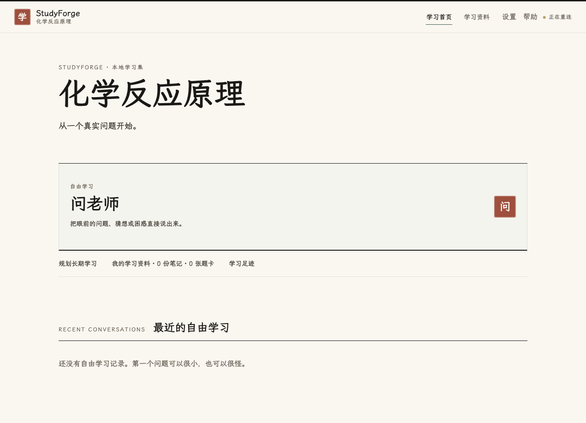
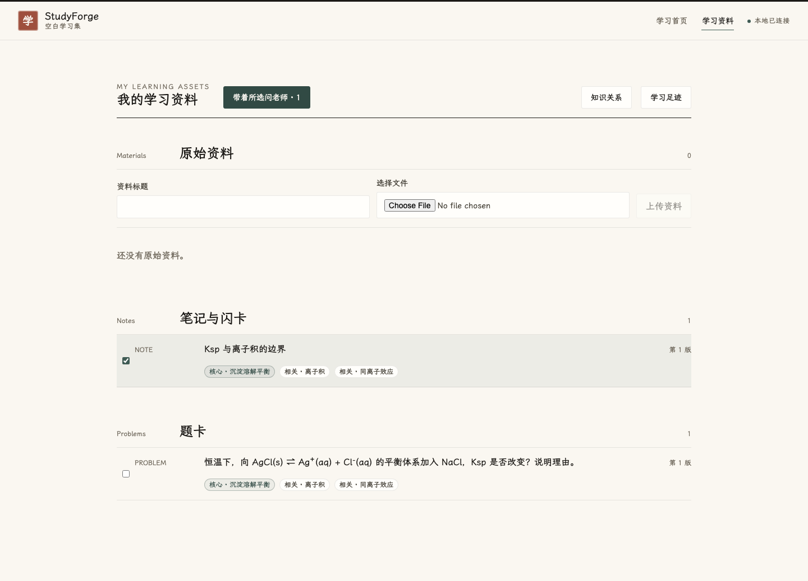
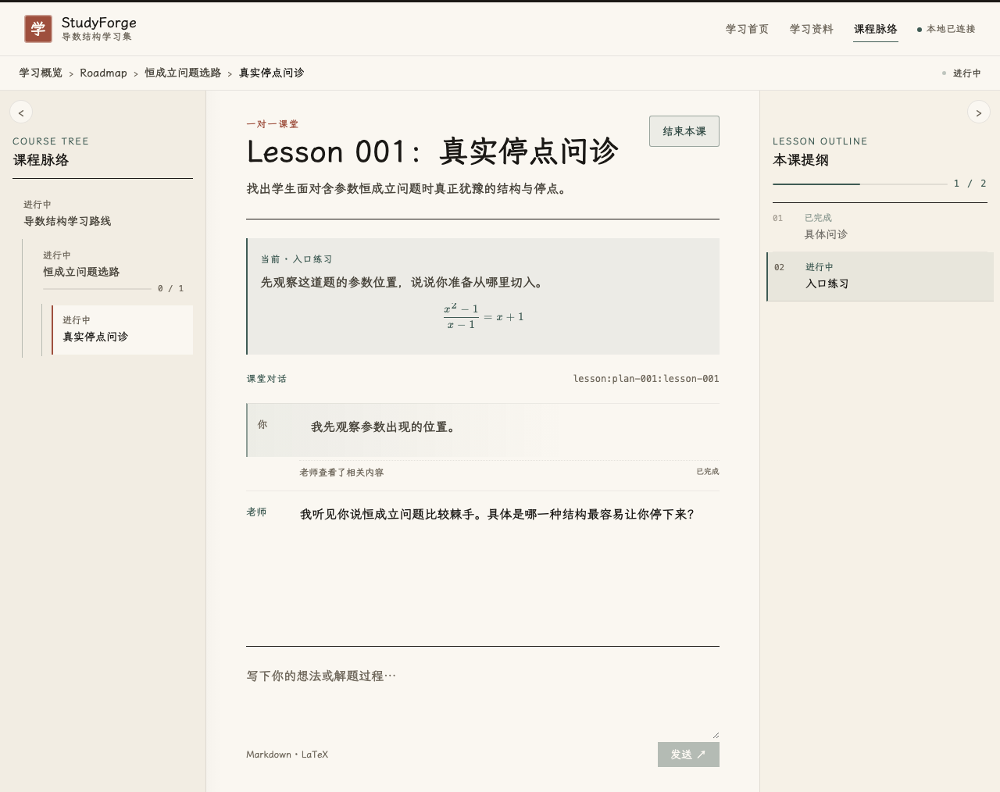

# 第一次学习

StudyForge 不要求你先会写学习计划。你可以先像使用聊天工具一样问一个真实问题，也可以在准备长期学习时和老师慢慢制定课程。

## 从空白开始

给学习集起一个你认得出的名字，点击“从空白开始”。进入首页后，最醒目的入口是“问老师”。这里开启的是自由学习：没有预设课次，也不要求一开始就有明确目标。

你可以说“我真的不知道化学反应原理该怎么学”，也可以只丢进一道题、一个不理解的现象或一段联想。老师会先弄清楚真正改变方向的问题，不会因为一句含糊表达就替你虚构能力缺陷。

## 让讨论留下来

当讨论形成了值得保留的内容时，老师会公开拟保存内容并询问你。你确认后可以：

- 保存为笔记：留下当前可读、可继续修改的理解；
- 保存为题卡：以后先看题干和自己的笔记作答，再决定是否查看标准答案；
- 不保存：继续聊，普通对话不强制变成资产。

“保存为笔记”不等于系统宣布你已经独立掌握。老师对学习情况的判断只依据真实表现，并在以后备课或讲解时按需召回。

## 带着资料继续问

在“学习资料”里可以打开笔记、题卡和原始资料。勾选想讨论的内容后点击“带着所选问老师”，新对话会只携带这些明确选择的上下文。题卡可以先作答、选择不会，再看标准答案；之后仍可带着这次作答继续问。

## 需要长期课程时

从首页进入长期学习讨论后，老师会先和你确认是否真的需要长期路径。完整方案公开、你明确确认后，才建立 Roadmap。

- Roadmap 讨论较长周期里希望发生的能力变化与检验标准；
- Plan 讨论一个阶段要解决什么，课次数量会随真实学习情况调整；
- Lesson 是一次具体课堂，备课草案仍要经过你和老师的讨论。

继续聊天、沉默或“你安排”都不等于批准尚未看见的方案。浏览和刷新也不会自动开始或结束 Plan、Lesson。

## 文件在哪里

每个学习集都保存在 `Documents/StudyForge`，核心内容是可以直接打开的 Markdown。App 升级与学习资料彼此分开；要备份时，完整复制对应学习集文件夹即可。
