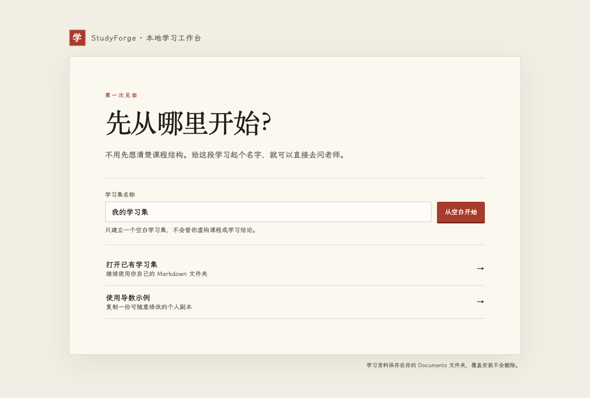
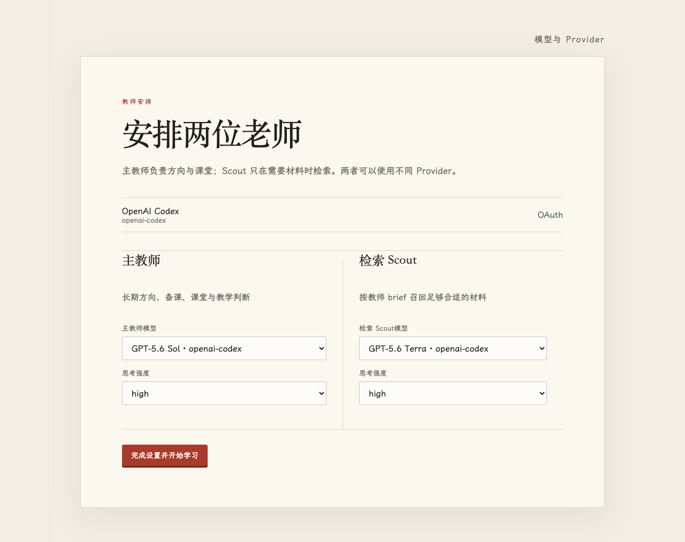

# 在 macOS 上安装 StudyForge

这份内测版已经把 StudyForge、教学 Runtime 和 Pi 一起装进 App。正常使用不需要安装 Bun、Node 或 Pi，也不需要打开终端。

## 1. 安装 App

1. 从你信任的内测链接下载 `StudyForge.dmg`。
2. 双击打开 DMG，把 StudyForge 拖到“应用程序”。
3. 在“应用程序”中双击 StudyForge。

## 2. 第一次被 macOS 拦住时

当前内测包采用 ad-hoc 签名，尚未经过 Apple 公证。macOS 因此可能提示无法验证开发者或无法检查恶意软件。这不是“已被 Apple 证明安全”的版本；只有在你确认下载来源可信、文件没有被替换时才继续。

先尝试打开一次 StudyForge，再进入“系统设置” → “隐私与安全性”，滚动到安全性区域，点击“仍要打开”，按系统提示确认。之后通常可以像普通 App 一样双击打开。若这是学校管理的 Mac，该按钮可能不可用，请联系管理员，不要绕过管理策略。

## 3. 选择学习集

首次打开有三个入口：

- “从空白开始”：只建立一份干净的 Markdown 学习集，适合真的不知道该怎么学时直接问老师。
- “打开已有学习集”：选择以前的 StudyForge 学习集文件夹，原文件只在后续真实学习时按正常流程更新。
- “使用导数示例”：复制一份内置示例到你自己的 Documents，不会修改安装包里的原件。

所有新建和复制的学习集都在 `Documents/StudyForge`。替换或升级 App 不会删除这里的学习资料。

## 4. 连接模型并安排老师

模型页会列出 Pi 当前支持的 Provider 与登录方式。先连接你要使用的 Provider，再分别选择：

- 主教师：负责长期方向、备课、课堂与教学判断。
- 检索 Scout：按教师给出的意图查找足够合适的材料，不替教师做最终判断。

推荐配置会在对应模型真实可用时显示：主教师使用 Sol、检索 Scout 使用 Terra，思考强度均为 high。若模型不可用，StudyForge 会要求重新选择，不会暗中换成别的模型。

StudyForge 使用独立的 Provider 凭据、模型设置和 Session 目录，不读取或改写普通 Pi 的配置。

## 5. 出现状态单时

状态单会区分学习集无效、Provider 未连接、模型不可用与本地教师未启动。按页面给出的动作重试、换模型或重新选择学习集即可；诊断失败不会自动开始、结束或改写课程。

如需反馈，请附上状态单里的诊断代码，不要发送 API Key、一次性登录码或完整学习集。
