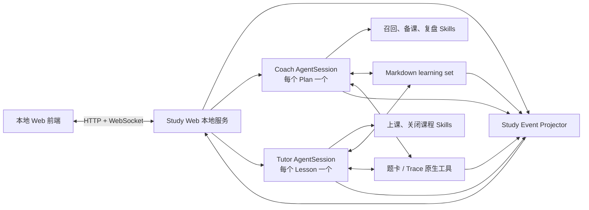
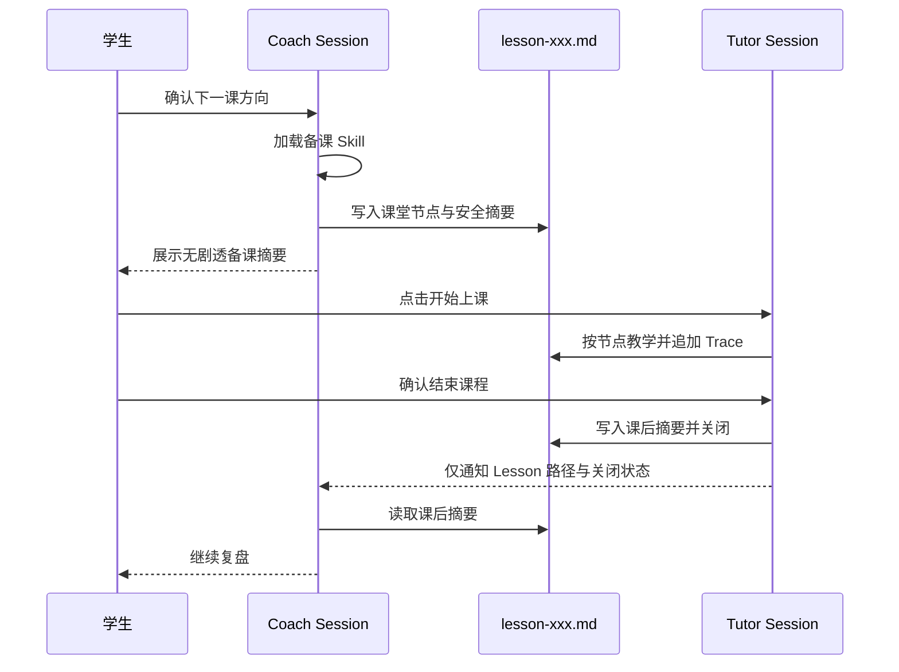

# Pi 教学 Web 前端设计

状态：已确认，等待实施计划

日期：2026-07-21

面向读者的中文说明：[Pi 教学前端：中文设计说明](../../zh-CN/Pi教学前端设计说明.md)

## 一、设计结论

Highschool Study 增加一个由 Pi 启动的本地 Web 前端。前端不是通用 Markdown 编辑器，也不是 Pi 终端的浏览器镜像；它把 `Roadmap → Plan → Lesson → ActivityBlock`、Coach/Tutor 会话和课堂事实投影成专门的学习界面。

前端直接使用 Pi 的 `AgentSession` SDK。首版只支持 Pi，不提前抽象 Claude Code 或 OpenCode 运行时。现有 Markdown learning set 继续作为唯一学习状态来源，题卡和教学图谱继续使用已有格式。`card_search`、`trace_search`、`trace_append` 和 `source_resolve` 四个工具契约保持不变；在 Pi 中由 extension 注册为原生工具，并与 Claude Code MCP 适配器共用同一套领域实现。

本设计只保留两个 Agent：

- Coach Agent：每个 Plan 一个持久 Session，负责方向讨论、课后复盘、进度解释和备课；备课是 Coach 按需加载的 Skill，不再单设 Designer Agent 或 Designer Session。
- Tutor Agent：每个 Lesson 一个持久 Session，只负责当前 Lesson 的多轮教学、课堂节点推进和 Trace 记录。

学生使用同一个聊天界面，前端根据阶段在 Coach Session 和 Tutor Session 之间自动切换。两个 Session 不复制彼此的聊天记录，只通过 learning set 文件交接。

## 二、目标与非目标

### 2.1 首版目标

- 从当前 learning set 展示学习集概述、Roadmap、Plan 和继续学习入口。
- 在一个连续界面中完成 Coach 讨论、备课、无剧透预览、Tutor 上课和课后复盘。
- 使用结构化组件呈现题目、材料、视频、阶段、输入请求、工具状态和课堂节点，避免页面退化成消息瀑布。
- 使用 `lessons/<lesson-id>.md` 同时保存课前课堂结构和课中实际节点状态。
- 支持文本、LaTeX、粘贴或上传手写解题图片。
- 默认只向学生返回 Student View；完整备课内容只在开发者启动模式中可见。
- 断开或刷新后，可以使用 Pi Session 和 Markdown 文件恢复当前学习位置。
- 用实时能力星图、动态课堂路线、课后回放和证据透镜呈现“为什么这样教、能力为什么变化”。
- 允许人设驱动视觉皮肤和轻量阶段动画，但不让展示层改变教学事实。

### 2.2 首版非目标

- 云端账号、同步、班级和多学生管理；
- 人类教师协作与权限后台；
- 数据库或第二套事件存储；
- 移动端原生应用；
- Obsidian 编辑器集成；
- Claude Code、OpenCode 等多运行时适配；
- 对拥有本机文件系统访问权的攻击者隐藏答案。

首版的 Student/Teacher 隔离用于防止课堂界面意外剧透，而不是建立操作系统级安全边界。

## 三、总体架构



本地服务承担四项职责：

1. 创建、恢复、暂停和释放 Coach/Tutor `AgentSession`；
2. 把浏览器输入发送给当前活动 Session；
3. 把 Pi 事件、Lesson 变化和教学工具结果确定性映射为 `StudyViewEvent`；
4. 为学生模式和开发者模式生成不同的数据投影。

它不拥有学习数据库，不复制 Roadmap、Plan、Lesson、Trace 或长期记忆。

## 四、Agent 与 Session 生命周期

### 4.1 Coach Agent

Coach 是学生的学习管理入口，职责包括：

- 读取 Roadmap、当前 Plan、相关 Lesson 摘要和两份已确认画像；
- 与学生讨论下一课方向和课后建议；
- 在学生确认方向后加载备课 Skill；
- 搜索真实题卡、读取绑定 Trace，并写出下一份 Lesson；
- 在 Plan 完成后运行长期记忆聚合和学生确认流程。

Coach Session 以 Plan 为生命周期。Plan frontmatter 可以保存可选的 `coach_session`；Lesson frontmatter 可以保存可选的 `tutor_session`。这两个字段属于 runtime authority，只能由本地服务绑定真实 Pi Session ID，模型不得填写或猜测。标识缺失或失效时，新建对应 Session 并从 Markdown 恢复，不把 Session 当成学习事实。

### 4.2 备课是 Coach Skill

备课不再拥有独立 Agent 或 Session。Coach 在当前 Plan Session 中按需加载备课 Skill：

1. 复盘上一课并与学生确认下一课方向；
2. 读取备课所需的记忆、题卡、Trace、图谱和材料；
3. 写入带 ActivityBlock 的 `lesson-xxx.md`；
4. 向学生只展示无剧透的课堂结构与安排理由；
5. 等待学生主动开始课程。

Coach 可以看到备课答案和 Teacher Control，但它不承担课堂教学。前端不向学生显示备课工具的原始结果。

### 4.3 Tutor Agent

Tutor Session 与一个 Lesson 一一绑定。它：

- 读取当前 Lesson、两份确认画像和直接来源；
- 一次只呈现当前 ActivityBlock 的 Student View；
- 根据 Teacher Control 执行提示、评价和分支，但不向学生转述这些内容；
- 在证据活动后追加 Trace，并更新 Lesson 节点状态；
- 在学生请求暂停或结束时立即执行相应流程；
- 学生确认结束后写入 Reflection 与 Lesson Summary，并关闭 Session。

暂停的 Lesson 保留 Tutor Session。正常关闭的 Tutor runtime 可以释放；Pi Session 文件仍可用于审计和恢复。

### 4.4 Session 交接



Tutor 不接收 Coach transcript；Coach 恢复时也不接收 Tutor transcript。交接消息只包含真实 Lesson 路径、状态和“请读取相应摘要”的指令。

## 五、Pi 的记忆承载方式

### 5.1 结论

Pi 可以承载本项目需要的记忆功能，但它与 Claude Code 的自动加载语义并不完全相同。项目不模拟一套 Claude Code memory；它使用 Pi 的原生资源加载能力，把不同记忆放在正确的层次：

- `AGENTS.md` / `CLAUDE.md`：稳定的项目指令与学习集入口；
- Pi Skills：按需加载的召回、备课、上课、复盘和长期记忆工作流；
- Pi Session JSONL 与 compaction：Coach/Tutor 各自的短期会话连续性；
- Roadmap、Plan、Lesson、画像、题卡和 Trace 文件：可跨 Session、可校正、可回溯的长期学习记忆；
- `DefaultResourceLoader`：为 Coach 和 Tutor 选择不同的角色指令、Skill 集、人设和本地配置。

Pi Session 和 compaction 摘要不是学习事实的 owner。即使 Session 文件丢失，Agent 也必须能够通过 learning set 恢复。

### 5.2 Context 文件与本地人设

两个 AgentSession 的 `cwd` 都设为 `learning-set/`。Pi 会沿父目录自动加载 `AGENTS.md` 或 `CLAUDE.md`；已在导数学习集上实测，它会同时加载：

```text
examples/derivative-demo/CLAUDE.md
examples/derivative-demo/learning-set/CLAUDE.md
```

Pi 不会自动加载 `CLAUDE.local.md`。本地服务通过 `DefaultResourceLoader.agentsFilesOverride` 显式追加：

- 当前 learning set 的可选 `CLAUDE.local.md`；
- 最终选中的一份人设文件；
- 一个很短的虚拟角色上下文，包含 Agent 角色、当前 Plan 或 Lesson ID 及其真实路径。

不把全部 Roadmap、画像、历史 Lesson 或题卡塞进系统提示词。它们由 Skill 在需要时读取。

### 5.3 Coach 与 Tutor 的不同资源视图

Coach ResourceLoader 提供：

- Coach 角色指令；
- 当前 Plan 定位；
- 负责读取学习集概述的进入 Skill，以及选中人设；
- Roadmap/Plan 召回、进度检查、备课、复盘、纠正记录和 Plan 记忆聚合 Skills；
- 四个题卡/Trace/来源原生工具。

Tutor ResourceLoader 提供：

- Tutor 角色指令；
- 当前 Lesson 定位；
- 选中人设；
- 教学召回、上课、关闭课程和纠正课堂记录 Skills；
- 课堂所需的题卡/Trace/来源原生工具；
- 不提供备课 Skill，也不注入 `planner-attention.md`。

Pi 只把 Skill 的名称和描述常驻上下文；完整 `SKILL.md` 在匹配或显式调用时才读取。前端触发关键流程时使用明确的 Skill 命令，避免依赖模型猜测是否加载。

现有 Claude Code Skills 是工作流内容来源，不作为可直接加载的 Pi 包。Pi 版本保留 Agent Skills 标准的正文与引用结构，移除 Claude Code 专属的 Agent 调用和工具名；Coach/Tutor 的真实工具权限由 `createAgentSession()` 配置，而不是依赖 Skill frontmatter 形成安全边界。

### 5.4 学习记忆的召回位置

| 记忆 | 持久 owner | Coach | Tutor |
|---|---|---|---|
| 学习集概述与 Roadmap | `ROADMAP.md` | 进入 Plan 和解释进度时读取 | 不完整注入 |
| Plan 目标与前序摘要 | `plans/<plan-id>.md` | 完整读取当前 Plan，按链接上溯 | 仅通过当前 Lesson 获得必要目标 |
| Lesson 结构与课堂记录 | `lessons/<lesson-id>.md` | 备课或课后复盘读取 | 完整读取当前 Lesson |
| 学生与教学画像 | `memory/student-profile.md` 与 `memory/teaching-profile.md` | 召回时完整读取两份确认画像 | 开课时完整读取两份确认画像 |
| 备课注意事项 | `memory/planner-attention.md` | 只在备课时读取 | 永不读取 |
| 题卡与绑定 Trace | `cards/` 与 Lesson Trace | 备课工具按需搜索 | 当前活动按需读取 |
| Session 对话历史 | Pi Session JSONL | 当前 Plan 内连续 | 当前 Lesson 内连续 |

同一 Plan 的前序 Lesson 摘要和后续 Plan 所需的前序 Plan 摘要仍按原设计通过 Markdown 链接召回。Pi 的上下文压缩只维持当前 Session 可用，不替代 Plan 完成后的长期记忆确认流程。

### 5.5 四工具在 Pi 中的承载

Pi 核心没有内置 MCP 客户端，因此首版不增加 MCP transport extension。实现时把四个工具背后的纯领域操作提取为共享模块：

```text
card_search
trace_search
trace_append
source_resolve
```

- Claude Code 插件继续由 MCP server adapter 暴露这些操作；
- Pi package 由 extension 使用 `registerTool()` 暴露相同名称、参数、返回值和真实性边界；
- Web 前端只观察工具事件，不直接调用领域模块写学习事实。

这不是运行时抽象层；只是让两个薄适配器复用同一套文件操作，避免复制题卡与 Trace 规则。

Web runtime 另外给 Tutor 注册一个不对外发布的 `classroom_update` 工具，用于更新 Block 状态和追加 Route Changes。它属于课堂 UI 协调，不扩大四个题卡/Trace 领域工具的公共契约。

## 六、页面结构

首版只有三个页面。

### 6.1 学习集首页

展示：

- `ROADMAP.md` 中的学习集概述；
- 当前 Roadmap 的能力目标；
- Plan 列表、依赖和当前状态；
- 最近 Lesson 与唯一主要操作“继续学习”。
- 当前 Plan 的能力星图摘要；节点点击后可打开对应证据透镜。

应用从一个 learning set 目录启动，因此首版不建设多学习集书架或文件管理器。

### 6.2 统一对话页

Coach、备课进度和 Tutor 课堂使用同一页面外壳。顶部状态显示：

- 规划中；
- 备课中；
- 等待开课；
- 上课中；
- 已暂停；
- 复盘中。

学生无需选择 Agent。前端根据状态切换底层 Session，同时保持统一的人设、视觉语言和输入框。

主区域采用对话流。结构化题目和材料作为消息流中的专用组件呈现；课堂节点抽屉提供可跳转的结构化回看，防止长课变成无法导航的消息瀑布。节点抽屉同时显示当前有效路线；节点插入、跳过、重排或重复时以动画更新，并展示学生安全的变更理由。

能力星图可以作为可折叠侧栏随课堂更新。它不占据作答主区域，也不在学生正在思考时弹出带答案倾向的诊断。

### 6.3 备课本

备课本直接读取当前 Lesson：

- 学生模式：课堂安排、节点标题、无剧透备课摘要、来源名称和完成状态；
- 开发者模式：额外显示 Teacher Control、题卡答案、提示阶梯、原始工具事件和来源解析信息。

已结束的 Lesson 在备课本中增加“课堂回放”标签；任一题卡、Trace、能力节点和路线变更都可以打开证据透镜。

默认服务以学生模式启动。使用显式 `--authoring` 启动同一应用时，服务才注册和返回开发者投影；学生模式不是用 CSS 隐藏敏感字段。

## 七、结构化事件投影

### 7.1 事件来源

界面消费三种已有事实：

1. Pi `AgentSessionEvent`：消息流、工具开始/结束、Extension UI 请求、Session 状态；
2. Lesson 快照与文件变化：当前 ActivityBlock、节点状态、Lesson 状态和证据链接；
3. 教学工具结果：真实题卡、Trace、来源和写入确认。

`Study Event Projector` 使用事件名、工具名和 Lesson 字段做确定性映射。它不调用另一个 LLM 推断应该渲染什么。

### 7.2 最小 `StudyViewEvent` 类型

- `message`：Coach、Tutor 或学生的自然语言消息及流式增量；
- `phase`：规划、备课、课堂、暂停、关闭和复盘阶段；
- `activity`：当前 ActivityBlock 的安全内容与状态；
- `resource`：题目、图片、视频或其他材料；
- `input`：文本、数学、选择或图片输入请求；
- `work-status`：搜索题卡、写入 Trace、加载材料等可折叠状态；
- `notebook-node`：课堂节点被激活、完成、跳过或恢复；
- `route-change`：课堂路线的插入、跳过、重排或重复；
- `ability-update`：Trace 使一个或多个方法节点的掌握度投影发生变化。

这些事件只存在于内存和 WebSocket 流中，不持久化为新日志。页面刷新时，从 Pi Session JSONL、Lesson Markdown 和现有 Trace 重新投影。

### 7.3 渲染规则

- 普通文本渲染为聊天气泡，数学公式由数学渲染器处理；
- `problem` ActivityBlock 渲染为题目卡和作答区；
- `material` ActivityBlock 渲染为图片、视频或文本材料卡；
- Extension 的选择、确认和输入请求渲染为原生交互组件；
- 工具调用默认折叠为人类可读状态，不显示完整参数或结果；
- thinking、题卡答案、rubric、Teacher Control 和未揭示提示不进入学生事件；
- Trace 写入成功只显示“已记录到当前课堂节点”，详细内容由证据视图按权限读取。

## 八、Lesson 节点格式

现有 Lesson Markdown 结构继续使用，只为每个 Block 增加一个最小状态区：

```markdown
## Block assessment-01

### Node State

- Kind: problem
- Required: true
- Status: active
- Depends on: orientation
- Uses: Q-DOMAIN-EX22

### Student View

请独立完成这道题，给出完整过程、理由和结论。

### Teacher Control

- Evidence target: 能否无提示写全定义域并实际使用
- Reveal: zero
- Card evidence: Q-DOMAIN-EX22 `step_2`、`step_5`

### Evidence

- [Trace event-007](#trace-event-007)
```

### 8.1 字段语义

- `Kind`：只决定呈现方式，首版闭集为 `dialogue | problem | material | reflection`；
- `Required`：是否属于本课必做节点；
- `Status`：首版闭集为 `pending | active | completed | skipped`；
- `Depends on`：前置 Block ID，可以为空；
- `Uses`：本 Lesson `Aliases` 中真实存在的题卡或材料别名，可以为空或包含多个；
- `Student View`：学生端唯一可以直接返回的 Block 正文；
- `Teacher Control`：教学目标、揭示策略、卡片步骤和提示，只供 Coach、Tutor 与开发者视图读取；
- `Evidence`：只保存 Trace 链接，不复制 Trace 的观察、评价或纵向结论。

Lesson 自身状态继续使用 `prepared | active | paused | closed`。一个 Lesson 最多有一个 `active` Block；关闭的 Lesson 不得保留活动 Block。

进度百分比、时间线文案、节点摘要和当前导航都由上述事实投影，不写成另一套状态。

### 8.2 学生图片

学生粘贴或上传的图片保存到：

```text
materials/classroom/<lesson-id>/
```

前端把图片作为 Pi prompt 的 image content 发送；形成课堂证据时，Trace 使用相对路径链接图片并绑定当前 Lesson/Block。图片是原始课堂材料，不嵌入长期画像。

### 8.3 课堂路线变更

初始课堂路线由 Block 的文档顺序、`Required` 和 `Depends on` 决定。课堂中发生插入、跳过、重排或重复时，不覆盖初始意图，而是在 Lesson 末尾追加一条路线变更：

```markdown
## Route Changes

### Route change route-001

- Action: skip
- Block: foundation-explanation
- Reason: 你已经无提示完成诊断，因此直接进入迁移练习。
- Source: [Trace event-007](#trace-event-007)
```

- `Action` 的首版闭集为 `insert | skip | move | repeat`；
- `Block` 必须引用当前 Lesson 中真实存在的 Block ID；
- `insert` 或 `move` 可以增加 `Before` 或 `After`，目标也必须是真实 Block ID；
- `Reason` 是学生可见、无剧透的一句话；
- `Source` 必须指向触发该决策的 Trace 或课堂记录；
- `route-xxx` ID 和追加顺序由本地服务绑定，模型不得猜测已有 ID。

当前有效路线由“初始路线 + Route Changes”重放得到。后续更正使用新的路线变更抵消前一条，不重写历史。实时 `route-change` 只是这份记录的 Web 投影。

Tutor 通过 session-local `classroom_update` 提交动作、真实 Block 别名、学生安全理由和来源；本地服务绑定当前 Session、Lesson、route ID 与追加位置，并同时产生 `notebook-node` 或 `route-change` 投影。Tutor 不用自由编辑这些 runtime authority 字段。

## 九、Student View 与 Teacher Control 边界

学生投影可以包含：

- 学习集概述、Roadmap 和 Plan 的学生可读内容；
- Lesson 的 Student View 与无剧透备课摘要；
- 当前真实题卡的题干、选项和已获准揭示的提示；
- 学生自己的作答、课堂节点状态和可公开的 Trace 摘要；
- 视频、图片和其他已安排材料。

学生投影不得包含：

- Teacher Control 原文；
- 题卡答案、完整解法、rubric 或未揭示步骤；
- 备课搜索候选、废弃方案或完整工具结果；
- Pi thinking；
- 未来 ActivityBlock 的教学路线或答案性提示。

这一边界由服务端 projection 函数实现。学生前端只接收安全 DTO，不接收完整 Lesson 或完整题卡后自行隐藏。

## 十、核心流程

### 10.1 打开学习集

1. Pi 包中的启动命令以当前目录寻找 `learning-set/`；
2. 本地服务验证必要目录和文件；
3. 浏览器打开当前学习集首页；
4. 服务从 Plan 的 Session 标识恢复 Coach，失败时新建并通过 Markdown 召回。

### 10.2 备课和开课

1. 学生与 Coach 完成上一课复盘和下一课方向确认；
2. Coach 加载备课 Skill，并更新备课状态事件；
3. Coach 写出完整 Lesson；
4. 服务解析 Lesson，仅向学生返回安全摘要和节点标题；
5. 学生点击开始上课后，服务创建或恢复该 Lesson 的 Tutor Session；
6. Tutor 每次只推进一个 ActivityBlock。

### 10.3 暂停、恢复与关闭

- 暂停：Lesson 写为 `paused`，保留当前节点和 Tutor Session；
- 恢复：先展示暂停点和剩余节点，学生再次明确选择后才继续；
- 关闭：必须由学生确认，Tutor 写入 Reflection、Lesson Summary 和最终节点状态；
- 返回：服务恢复原 Coach Session，并要求它从 Lesson 摘要开始复盘。

## 十一、技术组成

- Runtime：`@earendil-works/pi-coding-agent` 的 `AgentSession` SDK；
- 资源加载：每类 Agent 独立的 `DefaultResourceLoader`，负责 context files、Skills、人设和角色指令；
- 教学工具：Pi extension 原生工具，复用现有题卡与 Trace 领域模块；
- 课堂协调：仅 Tutor Session 可用的 `classroom_update`，负责节点状态和路线变更；
- 本地服务：TypeScript/Node.js；
- 前端：React Web 应用；
- 通信：HTTP 负责初始数据、上传和命令，WebSocket 负责事件流；
- 内容：Markdown 渲染与 LaTeX/KaTeX 数学渲染；
- 持久化：learning set 文件与 Pi 自身 Session JSONL；
- 分发：作为 Pi package 安装，由一个 extension command 启动服务和浏览器。

首版不引入通用状态同步框架、事件总线服务、ORM 或数据库。

## 十二、核心失败处理

只处理会阻止正常学习的五类失败：

1. **Pi 没有可用模型或凭据**：显示配置提示，不创建 Session；
2. **learning set 缺少必要文件**：列出真实缺失项，不猜测或自动生成学习事实；
3. **Lesson 节点无法解析**：停止开课并返回 Coach 修复，不把完整文件降级展示给学生；
4. **模型或连接中断**：保留 Lesson、输入草稿和 Session，允许重连后继续；
5. **没有合适题卡或来源**：展示真实空结果，让 Coach 缩减、替换材料或重新讨论目标，绝不编卡。

备课未成功写出可解析 Lesson 时，不创建 Tutor Session。

## 十三、测试与验收

### 13.1 自动测试

- Lesson parser 能读取现有 Block，并正确解析 `Node State`；
- Student projection 永远不包含 Teacher Control、题卡答案、rubric、未揭示提示或 thinking；
- `AgentSessionEvent`、Lesson 变化和教学工具结果映射为预期 `StudyViewEvent`；
- Coach/Tutor 的 ResourceLoader 只加载各自允许的角色上下文、Skills 和记忆入口；
- `CLAUDE.local.md` 与选中人设按显式 override 注入，未选择的人设不进入上下文；
- Coach/Tutor Session 创建、暂停、恢复、关闭和 handoff 正确；
- 上传图片能保存到真实相对路径，并作为 Pi image content 发送；
- 刷新后可由 Session JSONL 与 Markdown 重建课堂界面；
- 题卡搜索空结果不会产生虚构题目或路径。
- 能力聚合对主方法赋予较高权重、对次方法赋予较低权重，并排除已撤回 Trace；
- Route Changes 能重建当前路线，每条变化都引用真实 Block 和来源；
- 课堂回放在 Session JSONL 存在时显示完整时间线，缺失时明确降级为证据回放；
- 证据透镜遇到断链时停止下钻，学生投影不会越权读取 Teacher Control；
- 人设主题变化不改变 Agent 工具、Lesson、Trace、能力聚合或学生评价。

### 13.2 真实端到端验收

使用仓库中的导数学习集完成一次真实模型流程：

1. 打开学习集并恢复当前 Plan；
2. Coach 复盘并加载备课 Skill；
3. 生成包含多个课堂节点的下一课；
4. 学生查看无剧透摘要并开始上课；
5. Tutor 呈现真实题卡，接收文本、LaTeX 和手写图片；
6. 完成至少一个证据活动并写入 Trace；
7. 刷新页面，确认节点、消息和证据仍可恢复；
8. 产生一次带来源的路线调整，并观察路线动画；
9. 写入 Trace 后观察能力星图变化，并从节点下钻到原始证据；
10. 学生主动结束，返回原 Coach Session 完成复盘；
11. 打开课后回放，定位路线改变、手写图片与能力变化；
12. 切换人设主题，确认教学内容和证据保持不变。

### 13.3 首版成功标准

首版成功不以功能数量衡量，而以“一名学生能否在不接触文件系统和终端的情况下，完整上完一节真实课程，并保留可回溯学习证据”为准。

## 十四、旗舰演示功能

以下五项功能全部进入设计范围，但共用现有学习事实、来源链接和事件投影，不各自建立数据模型或后台。

### 14.1 实时能力星图

能力星图把 `graph/` 中的能力、题型、主方法和次方法节点绘制成可交互网络。当前 Lesson 涉及的节点高亮；当新的 active Trace 写入时，证据信号沿“题卡 → 方法 → 能力目标”传播并产生短暂动画。

首版掌握度采用已经确认的简单聚合：

- 每条 active Trace 从真实题卡取得主方法和次方法；
- 主方法获得较高权重，次方法获得较低权重；
- `assessment`、`support` 和课堂判断保持独立，不把有提示完成等同于独立掌握；
- 被纠正或撤回的 Trace 不参与当前投影；
- 同一节点同时展示支持证据、冲突证据和证据数量。

首版界面使用“待观察 / 不稳定 / 较稳”等区间和不确定性光晕，不展示未经校准的伪精确百分比。底层投影将来可以替换为正式 BKT，而不改变题卡、Trace 或前端交互契约。

交互包括：

- 悬停显示本次变化来自哪一张题卡和哪条 Trace；
- 点击节点打开证据透镜；
- 在课堂中只突出当前相关的局部子图；
- 在学习集首页展示整个 Plan 的压缩视图；
- 备课时把相同聚合结果投影到 `planner-attention.md`，但不把掌握度写回图谱节点。

### 14.2 动态课堂路线

课堂节点抽屉同时呈现两条路线：

- 浅色底图：Coach 备课时安排的初始 ActivityBlock 路线；
- 高亮实线：Tutor 当前实际执行的路线。

Tutor 根据真实课堂证据插入、跳过、重排或重复节点时：

1. 先按既有课堂规则与学生讨论或响应学生请求；
2. 在 Lesson 的 `Route Changes` 中追加带来源的决定；
3. 前端收到 `route-change` 投影并以平滑动画重排节点；
4. 在消息流中展示一句无剧透解释。

路线动画不能代替能力判断。Task 完成、时间经过或模型主观感觉都不能单独触发“已掌握”路线；改变必须能够链接到学生请求、Trace 或其他真实课堂记录。

### 14.3 课后学习回放

已关闭 Lesson 在备课本中提供可拖动时间轴。回放组合以下已有来源：

- Pi Tutor Session JSONL 中的学生与 Tutor 消息；
- Lesson 中的 ActivityBlock 状态与 Route Changes；
- Lesson Trace；
- 学生上传的手写图片；
- 题卡和材料真实路径；
- 能力星图在各 Trace 时点的可重建投影。

时间轴可以定位：

- 首次暴露问题的节点；
- 学生的首次尝试和后续修正；
- 提示阶梯实际推进到哪一级；
- 哪条 Trace 形成支持或冲突证据；
- 课堂路线何时、为什么改变；
- 能力星图在课前与课后的差异。

回放不保存第二份完整事件日志。若 Pi Session JSONL 缺失，页面明确降级为“证据回放”：仍展示 Lesson 节点、Route Changes、Trace、题卡和图片，但不伪造缺失的完整聊天内容。

### 14.4 证据透镜

证据透镜是通用侧边面板，不是新页面。它可以从能力节点、题卡、Trace、路线变更或课后结论打开，并沿真实链接展示：

```text
Roadmap 能力标准
  → Plan 目标
  → Lesson / ActivityBlock
  → Trace 与学生原始作答
  → 真实题卡或材料
  → 主方法 / 次方法节点
```

路径由 Markdown 链接、Lesson alias、题卡方法字段和 `source_resolve` 结果拼接，不建立第二套知识图谱。断链时显示断点，不自动补造关系。

学生模式只显示安全来源、自己的作答和已经公开的判断；开发者模式可以继续下钻到 Teacher Control、题卡步骤和原始工具结果。

### 14.5 二次元课堂皮肤

人设继续只控制表达和展示。前端可以为当前人设加载头像、配色、轻量动效和不同阶段的视觉状态：

- Coach 规划；
- 备课处理中；
- Tutor 讲解；
- 等待学生作答；
- 完成节点；
- 课后复盘。

视觉状态只由 `phase`、`work-status` 和 `notebook-node` 等确定事件驱动，不让模型输出任意动画指令。角色包缺失或加载失败时退回中性教师主题，不影响会话、Lesson 或证据写入。

首版使用静态立绘加 CSS/Rive/Lottie 一类轻动效即可；Live2D 等更重的角色运行时属于可替换展示插件，不成为课堂主流程依赖。

### 14.6 与三个现有页面的关系

五项功能不增加新的顶级导航：

| 功能 | 学习集首页 | 统一对话页 | 备课本 |
|---|---|---|---|
| 能力星图 | Plan 总览 | 当前局部子图 | 课前/课后对比 |
| 动态课堂路线 | 最近 Lesson 摘要 | 实时节点抽屉 | 初始/实际路线对照 |
| 学习回放 | 最近回放入口 | 不占据当前课堂 | 完整时间轴 |
| 证据透镜 | 从能力节点打开 | 从题目与 Trace 打开 | 从总结与路线变化打开 |
| 二次元皮肤 | 学习集主题 | Coach/Tutor 状态 | 轻量主题，不遮挡文档 |

这些功能的目标不是装饰仪表盘，而是把“个性化教学正在发生”变成可观察、可解释、可回溯的体验。

## 十五、实施切片

完整设计按依赖关系拆成五个可独立验收的切片，避免同时铺开所有界面：

1. **Pi runtime 与安全投影**：Coach/Tutor Session、ResourceLoader、原生四工具和 Student/Teacher DTO；
2. **课堂核心界面**：三个页面、结构化事件、Lesson 节点、文本/LaTeX/图片输入和基础恢复；
3. **证据可视化**：主次方法聚合、实时能力星图和证据透镜；
4. **课堂时序**：Route Changes、动态路线和课后学习回放；
5. **展示层收口**：二次元主题、轻量动画、完整导数学习集 E2E 与演示脚本。

每个切片都必须在导数学习集上形成可运行的纵向闭环后才能进入下一片。后续实施计划按这些切片拆任务，不把它们实现成五套孤立的数据服务。
