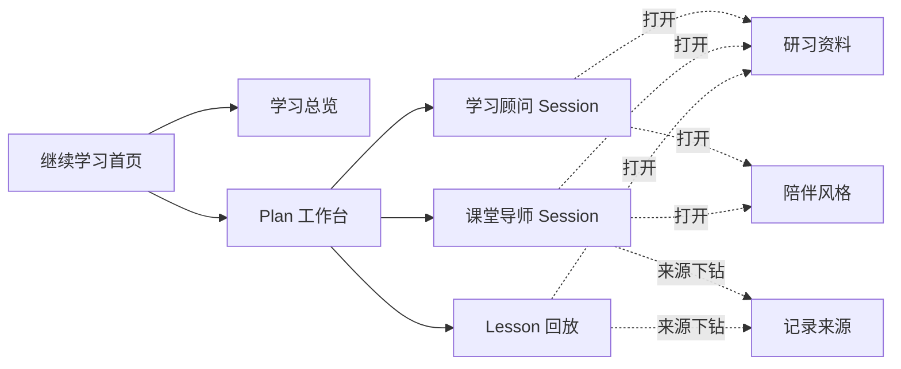
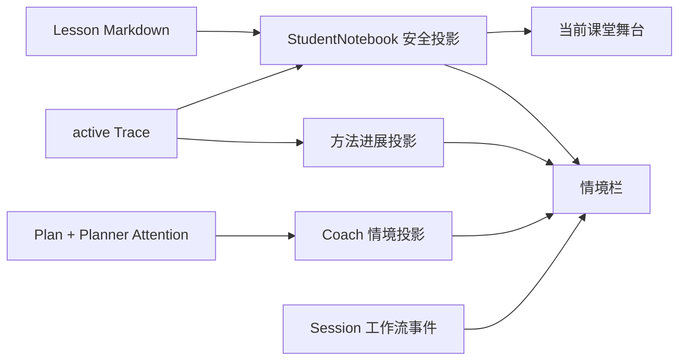

# StudyForge 剩余前端面板纵向迁移设计

状态：设计已通过，等待书面复核

日期：2026-07-28

## 一、问题与结论

旧分支 `codex/app-function-panels` 曾经实现过一组产品面板，但它从较早的
`731dfb9` 分叉。当前 `main` 已经增加 Roadmap Coach、严格 Session owner、
Lesson 准入、Plan 写回、真实课堂修订和新的长期记忆聊天卡片语义。直接合并或
cherry-pick 旧分支，会把过时的数据契约和页面组织一起带回来。

本设计只迁移仍有价值的四块体验：

1. 当前 ActivityBlock 固定课堂舞台与纵向情境栏；
2. 学生安全的学习资料搜索；
3. 以“继续学习”为中心的学习集首页；
4. 陪伴风格与显示偏好抽屉。

四块共享现有 Plan 工作台和视觉语言，但分别形成可独立实施、测试和回退的纵向切片。
它们不新增教学事实，不改变 Coach/Tutor 权限，也不引入数据库、索引服务或新的公共
MCP 工具。

Plan 长期记忆确认不再采用旧分支的强制弹窗，而以
`2026-07-28-plan-memory-review-chat-card-design.md` 为唯一设计依据。

## 二、迁移方式

曾考虑三种方式：

| 方式 | 优点 | 问题 |
|---|---|---|
| 整体合并旧分支 | 表面上最快 | 与当前 Session、Roadmap 和记忆语义冲突，回归面太大 |
| 按旧提交逐个 cherry-pick | 能保留部分提交历史 | 每个提交仍基于旧契约，冲突解决会掩盖真实设计差异 |
| 在当前 `main` 上纵向重做 | 每次只引入一条完整体验，可按当前事实边界验收 | 需要重新实现少量投影与组件 |

采用第三种。旧分支只用于参考布局、交互和已有测试意图，不作为代码来源或兼容目标。
每个切片都从当前 `main` 的组件和领域读取器出发，完成后即可单独合并，不等待其他
切片。

## 三、共同边界

### 3.1 不改变事实所有权

| 内容 | 唯一正式来源 |
|---|---|
| Roadmap、Plan、Lesson、画像 | learning set Markdown |
| 题卡、方法节点、材料 | `cards/`、`graph/`、`materials/` |
| 学生作答与方法归属 | active Trace |
| Coach/Tutor 对话及临时工作状态 | 对应 Pi Session JSONL |
| 首页、课堂舞台、情境栏、搜索结果、人设预览 | 可重建的前端投影或浏览器显示偏好 |

展示层不判定 mastery，不改写 Plan，不推进 ActivityBlock，也不因一次点击生成 Trace。
所有学习事实仍由 Session-bound 工具写入，前端只在正式来源更新后刷新投影。

### 3.2 不改变 Agent 边界

- Roadmap Coach 继续负责全局方向和创建学生认可的新 Plan；
- Plan Coach 继续负责当前 Plan 的复盘、备课与最终审阅；
- Tutor 继续只负责当前 Lesson；
- 四块面板都不是新 Agent，也不会把一个 Session 的历史复制给另一个 Session。

学生界面可以使用更自然的称呼，但内部角色、Session key、工具权限和文档术语仍保留
`Roadmap Coach`、`Plan Coach` 与 `Tutor`。

### 3.3 视觉与语言原则

视觉主张是“一张正在学习的书桌”，不是管理仪表盘：

- 左侧只回答“我在哪里”；
- 中间只回答“我现在做什么”；
- 右侧只回答“这一步和前后文有什么关系”；
- 覆盖层只在学生主动查资料或调整呈现时出现；
- 使用留白、字号和分隔线组织信息，不堆叠成卡片矩阵；
- 沿用当前留白新中式主题，只使用一套强调色。

面向学生的固定用语如下：

| 技术名 | 学生界面 |
|---|---|
| Roadmap Coach | 学习总览 |
| Plan Coach | 学习顾问 |
| Tutor | 课堂导师 |
| Evidence / Trace list | 学习记录 |
| Ability Map | 方法进展 |
| Evidence Lens | 记录来源 |
| Deep workflow | 深入查找 |
| Content Explorer | 研习资料 |
| Persona | 陪伴风格 |

这些只是显示文案，不重命名文件、类型、Session 或工具。

### 3.4 页面层级

顶级路由继续只有：

```text
/
/roadmap
/plan/:planId
/plan/:planId/lesson/:lessonId
```

研习资料、记录来源和陪伴风格使用当前工作台内的覆盖层，不增加顶级页面。覆盖层关闭后
回到原 Session、原 URL 和原聊天滚动位置。



## 四、切片一：当前课堂舞台与情境栏

### 4.1 要解决的问题

当前 Tutor 页面把题目、课堂节点和对话分散在消息流与右栏。学生容易在滚动后失去
“现在正在处理哪一个课堂积木”，右栏也只能在课堂本和方法证据之间二选一。

新布局仍保持三栏，但重新分工：

```text
左：Session 与 Lesson 位置
中：当前 ActivityBlock 固定舞台 + 自然对话
右：按当前视图组织的纵向情境栏
```

### 4.2 当前 ActivityBlock 舞台

只在 `active` 或 `paused` Tutor Lesson 中显示。舞台读取现有 Student View，并包含：

- Block 序号、类型和标题；
- 已公开的 `studentView`；
- 当前 `problem` Block 通过唯一 `Uses` 绑定的真实题卡题干与选项；
- 当前材料或视频的学生可见入口；
- 暂停状态下的“继续上课”操作。

舞台不读取或呈现：

- Teacher Control；
- 题卡答案、rubric、未揭示提示或另解正文；
- pending Block 的 Student View；
- Tutor 的内部判断和工具参数。

Block 选择规则保持简单：

1. `active` 或 `paused` Lesson 只显示真实状态为 `active` 的 Block；
2. 没有 active Block 时显示“等待课堂导师推进”，不擅自选取第一个 pending Block；
3. `prepared` Lesson 继续使用开课预览和准入入口，只列 Block 标题、类型、顺序和
   必选/可选状态，不提前呈现 Student View 或题卡正文；
4. `closed` 或 `abandoned` Lesson 进入 Replay，不再显示“当前课堂”舞台。

ActivityBlock 的结构化正文只在舞台渲染。右栏课堂路线仍列出全部节点，但 active
节点不再重复完整正文；completed 节点可以展开已经公开的 Student View，pending
节点只能显示标题与状态。普通 Coach/Tutor 消息保持原样；前端不通过文本相似度删除
或改写模型消息。

### 4.3 纵向情境栏

右栏由少量可折叠段落组成，不做面板轮播，也不让所有内容默认展开。

Plan Coach 默认顺序：

1. **本阶段**：Current Position、Next Lesson Candidate、Plan Summary；
2. **备课提醒**：现有 Planner Attention；
3. **前课摘录**：本 Plan 已关闭 Lesson 的摘要及精确来源；
4. **深入查找**：仅在存在 proposed/running 或最近 completed 工作流时出现。

Tutor 默认顺序：

1. **课堂脉络**：全部 Block 的状态和真实停止点；
2. **方法进展**：现有 ability projection；
3. **近期学习记录**：当前 Lesson 最新 active Trace；
4. **深入查找**：仅在当前 Session 有相关工作流时出现。

Replay 默认顺序：

1. **回放定位**；
2. **原定路线与实际路线**；
3. **方法进展变化**；
4. **学习记录来源**。

每种视图默认只展开第一段。其他段落用一行摘要说明是否有内容，学生主动点击才展开。
情境栏不会改变 Agent 可见上下文：它与 Coach/Tutor 的 Skill 召回是两件事，只是把
已经存在的事实和投影展示给学生。

### 4.4 数据流



不新增统一的 `study_context_get`。所需数据分别来自现有 Notebook、ability、workflow
和 Plan 读取器；前端负责组合，不建立第二份聚合事实。

课堂节点、Trace 或关课事实成功写入后，继续使用现有 workspace snapshot、
activity event 和 ability update 刷新相关投影。不得先乐观显示“已完成”或“已记录”。

### 4.5 交互与降级

- 桌面端保留左窄、中宽、右窄的稳定构图；
- 较窄窗口中右栏变成可呼出的上下文抽屉，舞台仍留在中栏；
- 切换 Block 时舞台做一次短暂淡入与纵向位移，不滚回聊天顶部；
- `prefers-reduced-motion` 或显示偏好关闭动效时直接替换；
- 某一情境段读取失败，只显示该段不可用，不阻塞聊天、作答或开关课；
- Notebook 不可用时不展示猜测内容，聊天仍可恢复。

### 4.6 验收

必须证明：

1. active Block 的 Student View 和真实题卡固定显示；
2. pending Block、Teacher Control、答案和未揭示提示不会进入舞台；
3. Block 推进后舞台与课堂脉络同步更新；
4. paused Lesson 保留当前 Block，但禁止作答直到学生继续；
5. closed Lesson 保留最终 Tutor 消息并进入只读 Replay；
6. Coach、Tutor、Replay 看到不同且正确排序的情境段；
7. Trace 写入后近期记录和方法进展刷新；
8. 任一辅助段失败不阻塞当前 Session。

## 五、切片二：学生安全的研习资料

### 5.1 定位

研习资料是只读搜索与来源浏览器，用于查找：

- 真实题卡；
- 方法图谱中的规范节点；
- 本地材料与视频切片；
- active Trace 所绑定的真实题卡和方法。

它不是学习集编辑器，也不是另一个 Agent。搜索由现有领域读取器确定性完成，不调用
模型，不生成不存在的题号、路径或理由。

### 5.2 搜索与反查

搜索结果以真实资产为中心。每条结果包含：

- 类型、标题和安全摘要；
- 精确来源路径；
- 命中原因；
- 与该资产关联的完整 active Trace 历史；
- 题卡的安全题干与选项，或材料的安全预览。

查询同时覆盖资产文本和 active Trace 的学生安全字段。若查询命中某条 Trace 的
Lesson、Block、方法或 note，结果返回该 Trace 绑定的真实题卡，并标记“由学习记录
命中”。这样同时满足：

```text
题卡 → 查看全部 active Trace
Trace → 反查真实题卡
方法节点 → 查看使用该方法的 active Trace 与题卡
```

Trace 不作为脱离题卡的孤立搜索结果；其来源下钻继续复用现有记录来源透镜。
superseded Trace 不参与普通结果和计数。

### 5.3 可见范围

| 打开位置 | 搜索范围 |
|---|---|
| Plan Coach | 整个学习集的学生安全资产 |
| active / paused Tutor | 当前 Lesson 已公开的题卡、材料、方法及其 active Trace |
| closed / abandoned Replay | 整个学习集的学生安全资产，优先当前 Lesson 来源 |

首版不在 Roadmap Coach 和首页开放研习资料入口。Roadmap Coach 负责方向商议，不需要
在还未进入 Plan 时浏览整套题库。

“已公开”只包括：

- 状态为 `active` 或 `completed` 的 Block 所引用的 Student View 来源；
- 当前学生自己的 active Trace 已确认的方法节点和真实题卡；
- Tutor 已明确呈现的本地材料。

不能因为某个 pending Block 已写在 Lesson 文件里，就把其 Student View、题卡或方法
视为已公开。

任何视图都不返回：

- 题卡答案与 rubric；
- Teacher Control；
- 未揭示提示；
- private evidence matrix；
- alternative sidecar 中保存的另解正文；
- 子任务的私有结论。

### 5.4 界面

研习资料从工作台左栏或来源入口打开。桌面端采用两列覆盖层：

```text
左：搜索框、类型筛选、结果列表
右：当前结果的安全预览、来源和相关学习记录
```

移动或窄窗口采用单列，点击结果进入详情，再返回列表。默认筛选是“全部”，其他筛选为
“题目 / 方法 / 材料”。空结果明确显示“当前真实来源中没有匹配内容”，不提供自动
编卡或相似内容填充。

点击学习记录打开现有记录来源透镜；关闭透镜后仍回到原搜索结果和滚动位置。点击题卡
不会启动 Lesson、写 Trace 或改变当前 ActivityBlock。

### 5.5 数据与接口边界

该切片只增加一个 Session-scoped 只读搜索边界。请求必须携带当前真实 Session key，
由运行时根据 Session owner 和 Lesson 状态确定范围；前端不能提交“全库模式”绕过
Tutor 限制。

搜索直接读取现有资产和 active Trace。首版不增加：

- 后台索引；
- 向量库；
- 搜索缓存数据库；
- 通用文件编辑器；
- 新公共 MCP 工具。

### 5.6 降级与验收

- 空查询和空命中正常返回空列表；
- 来源断链时保留结果标题并明确显示断点，不猜测正文；
- 搜索失败只关闭或降级研习资料，不影响当前 Session；
- 非法 Session、错绑 Lesson 或越权范围直接拒绝。

必须证明：

1. 题卡结果只来自真实文件；
2. 每张题卡附带全部 active Trace，且不包含 superseded Trace；
3. 用 Trace note、方法、Lesson 或 Block 可以反查对应题卡；
4. active Tutor 无法搜到 pending Block 的题卡、材料或方法；
5. Coach 和 Replay 可以读取完整学生安全范围；
6. 答案、Teacher Control、未揭示提示和另解正文不会泄漏；
7. 空结果保持为空；
8. 点击 Trace 能进入现有来源透镜并返回原搜索位置。

## 六、切片三：继续学习首页

### 6.1 定位

当前首页先展示学习集介绍和 Plan 列表。新首页仍保留学习集概述与研习要领，但第一屏
只突出一个问题：“我现在最适合从哪里继续？”

页面层级为：

1. 唯一主操作：继续最近有效的学习位置；
2. 当前学习阶段、进度与 Coach 已写回的下一步；
3. 最近两条方法进展或学习记录；
4. 最近一节可回看的 Lesson；
5. 其他 Plan 与低频的学习总览入口；
6. 学习集概述与研习要领。

首页不展示完整能力图、题库、工作流历史、大面积统计或“落后天数”。

### 6.2 继续目标

浏览器只保存最后一个有效的 Plan Coach 或 Lesson 路由，作为 UI 偏好
`lastVisitedRoute`。它不写入 learning set，也不成为学习事实。

确定主操作时依次判断：

1. 保存路由仍属于当前 Roadmap，且指向 Plan Coach 或状态为
   `active`、`paused`、`prepared` 的 Lesson；其中 Plan Coach 所属 Plan 必须仍是
   active 或未完成状态；
2. 当前 active Plan 中第一个 `active` Lesson；
3. 当前 active Plan 中第一个 `paused` Lesson；
4. 当前 active Plan 中第一个 `prepared` Lesson；
5. 当前 active Plan 的 Plan Coach；
6. 没有 active Plan 但仍有未完成 Plan 时，打开其 Plan Coach；
7. 没有 Plan 时，主操作变为“建立第一个学习阶段”，打开 Roadmap Coach；
8. 所有 Plan 已完成且没有 active Plan 时，主操作变为“规划下一阶段”，打开
   Roadmap Coach。

closed 或 abandoned Lesson 不作为“继续学习”的主目标，但可以出现在最近回放。
`/roadmap` 不写入 `lastVisitedRoute`；已有 active Plan 时，学习总览保持低频的次要
入口。

### 6.3 信息来源

- 当前阶段、Current Position、Next Lesson Candidate 和 Plan Summary 来自真实 Plan；
- Lesson 进度来自 Plan Lesson Index 与真实 Lesson 状态；
- 最近方法进展从 active Trace 与 ability projection 得到；
- 最近回放来自最近关闭的真实 Lesson；
- 学习集概述与学生研习要领来自现有公开 Markdown。

首页打开时不调用模型，不重新生成 Coach 建议。若 Plan 尚未写回下一步，首页直接说
“等待学习顾问复盘”，不根据 Trace 自行做教学决策。

### 6.4 路由与刷新

- 每次成功进入 Plan Coach、active/paused/prepared Lesson 后才更新保存路由；
- 直接输入 URL、刷新、后退和前进继续使用现有 browser route 恢复；
- 保存路由失效时按上述确定性顺序降级；
- 首页每次打开都重新读取 Roadmap，确保新注册 Plan 立即可见；
- 页面不自动切换 Plan，主操作也必须由学生点击。

### 6.5 视觉与动效

第一屏以当前阶段和主操作形成一个完整构图，不使用多个并列 CTA。进度、最近变化和
回放作为平面列表与细分隔线出现，其他 Plan 退到下方。

页面进入时只做一次标题与主操作的轻微错峰淡入；进度数字变化做短暂过渡；不使用
连续粒子、打卡火焰、倒计时或游戏化奖励。

### 6.6 降级与验收

- 首页投影部分失败时至少保留学习集概述、真实 Plan 列表和学习总览入口；
- 保存路由无效时不报错打断学生，直接使用确定性降级；
- 没有 active Trace 时隐藏“最近变化”，不制造空统计；
- 不为首页失败增加后台重试队列或第二份导航状态。

必须证明：

1. 首页恰好只有一个主操作；
2. 有效保存路由优先，失效路由安全降级；
3. active、paused、prepared、Coach 的顺序正确；
4. closed/abandoned Lesson 只进入回放，不成为继续目标；
5. 无 Plan 和全部完成两种状态都正确打开 Roadmap Coach；
6. 首页内容全部可回到正式来源；
7. 首页不调用模型，也不修改 Plan；
8. 新注册 Plan 在返回首页后立即出现。

## 七、切片四：陪伴风格与显示偏好

### 7.1 定位

当前聊天页使用下拉框选择人设。新设计把它改为可预览的“陪伴风格”抽屉，同时明确
区分两类状态：

- **陪伴风格**：当前 Pi Session 的 Agent 表达方式；
- **显示偏好**：当前浏览器的动效与节点完成反馈。

两者都不属于学生画像或教学事实。

### 7.2 陪伴风格

点击聊天栏中的当前形象打开抽屉。每个选项展示：

- 名称；
- 面向学生的简短说明；
- 字符徽记或静态头像；
- 一组克制的主题色预览；
- 当前是否正在使用。

选择后立即更新当前 Session 的 persona custom entry，并从下一次 Agent 回复开始生效。
已经生成的历史消息不重写。Roadmap Coach、不同 Plan Coach 和不同 Tutor Session
继续各自保存选择，不互相覆盖。

学习集仍可在 `.claude/personas/<id>.md` 中覆盖或增加人设。人设 Markdown 至少提供
现有 `ID` 与 `Display name`；可以额外提供学生可见的 preview、glyph、accent 和
portrait 元数据。缺少可选元数据时使用中性说明、名称首字和默认配色，不阻止人设
本身加载。

可选元数据使用现有列表式 Markdown，不引入 JSON manifest：

```markdown
- Student preview: 冷静、简洁，会先帮你理清结构再追问。
- Glyph: 静
- Accent: #48636f
- Portrait: `.claude/personas/assets/calm-senpai.webp`
```

可选项由内置人设与 `.claude/personas/*.md` 合并得到；同 ID 的学习集文件覆盖内置
文件，文件名、`ID` 和 Session 选择值必须一致。Portrait 只能解析到 learning set
内部的本地静态图片。

人设正文只进入 Agent 表达上下文，抽屉只显示明确标记为学生可见的预览元数据，不把
内部提示词逐条展示给学生。

### 7.3 显示偏好

首版只有两个浏览器本地选项：

- 轻柔动效：`gentle / reduced`；
- 节点完成反馈：`on / off`。

它们保存在 localStorage，不写入 Session、CLAUDE 文件或画像。系统
`prefers-reduced-motion` 的限制优先于浏览器偏好。

没有保存值时默认使用 `gentle` 和完成反馈开启；若系统要求 reduced motion，则实际
动效直接降为 `reduced`。保存值损坏时回到同一默认规则。

节点完成反馈只在正式 ActivityBlock 状态由 active 变为 completed 后出现一次轻量
视觉反馈。它不播放夸张奖励、不生成 Trace，也不把 skipped 或 lesson_close 误算为
完成。

### 7.4 角色显示名称

抽屉迁移时一并完成学生界面的显示文案替换：

- Session Tree 中的 Plan Coach 显示为“学习顾问”；
- Tutor 消息角色显示为“课堂导师”；
- Roadmap 页面显示为“学习总览”；
- 技术诊断、开发日志与原始 Session 仍保留 Coach/Tutor。

显示名称不能参与 Session identity，也不能影响 owner 校验。

### 7.5 降级与验收

- 人设资源缺失或元数据不完整时回退到中性呈现；
- 人设切换失败时保持原选择和原主题；
- 显示偏好读取失败时回到系统动效偏好与上述默认值；
- 抽屉失败不阻塞聊天；
- 不增加好感度、虚拟货币、抽卡、每日任务或 Live2D runtime。

必须证明：

1. 抽屉可以预览并切换现有与学习集自定义人设；
2. 选择只作用于当前 Session，重启后可恢复；
3. 历史消息不会被改写；
4. 人设不会改变 Agent 权限、评分、提示规则或教学事实；
5. 内部人设提示词不会出现在学生预览；
6. 显示偏好只保存在浏览器；
7. reduced motion 和节点反馈开关真实生效；
8. 缺失资源可靠回退到中性呈现。

## 八、共享接口与组合方式

实现时只需增加或扩展少量只读投影：

| 投影 | 用途 |
|---|---|
| `HomeSnapshot` | 首页继续目标、当前阶段、最近变化与回放 |
| `CoachContextView` | Plan 情境栏中的位置、提醒和前课摘要 |
| `StudentNotebook.recentRecords` | 当前 Lesson 的 active Trace 摘要 |
| `ContentSearchResult` | Session-scoped 真实资产搜索 |
| 扩展后的 `PersonaPresentation` | 学生可见的人设预览元数据 |

组件边界：

| 组件 | 唯一职责 |
|---|---|
| `CurrentActivityStage` | 渲染当前 active Block 的安全学生视图 |
| `ContextStack` | 根据 Coach/Tutor/Replay 组合既有投影 |
| `ContentExplorer` | 搜索和预览学生安全资产 |
| `LearningSetHome` | 呈现唯一继续目标与压缩首页信息 |
| `PersonaDrawer` | 选择当前 Session 人设和浏览器显示偏好 |

不建立一个包揽全部状态的新 Store。当前 `App` 继续负责路由和当前 Session 编排；每个
投影失败时独立降级。

## 九、与长期记忆聊天卡片的关系

长期记忆卡片先按独立设计实现。四块面板只与它发生两处轻量衔接：

1. Plan 完成后，首页可以继续显示该 Plan 已完成，但不把“是否处理记忆候选”当作
   进入其他 Plan 的门；
2. 记忆候选中的 active Trace 来源继续打开记录来源透镜。普通 Plan/Lesson/画像来源
   若以后需要富预览，再复用研习资料的安全来源组件。

研习资料、人设抽屉和情境栏都不能提出、修改或自动采用长期记忆。

## 十、实施顺序

推荐顺序为：

1. 先完成已经单独定稿的长期记忆聊天卡片；
2. 当前课堂舞台与情境栏；
3. 学生安全的研习资料；
4. 继续学习首页；
5. 陪伴风格与显示偏好；
6. 在隔离学习集上跑一次完整跨 Plan/Lesson 产品验收。

理由：

- 舞台与情境栏直接改善每天使用最多的课堂；
- 研习资料复用其来源下钻和上下文入口；
- 首页在核心工作台稳定后再汇总真实入口；
- 人设抽屉最后收口视觉和文案，不干扰前面数据契约。

每个切片单独提交。任何一块失败都可以停在当前 `main` 的既有界面，不需要维护新旧
两套路由或兼容层。

## 十一、整体验收

自动验收覆盖：

- TypeScript 类型检查、单元测试和生产构建；
- Playwright 路由、刷新、返回与覆盖层恢复；
- Student View 防剧透；
- Session scope 和 persona 隔离；
- active Trace、ability 和课堂节点刷新；
- 公共 Claude MCP 工具数仍为四个。

最终在复制的 learning set 上完成一条产品流程：

```text
首页继续学习
  → 进入 Plan Coach
  → 打开研习资料并返回
  → 开始 prepared Lesson
  → 舞台随 Block 推进
  → Trace 写入后情境栏刷新
  → 暂停并恢复
  → 学生确认结束
  → Replay
  → 返回 Coach
  → 完成 Plan 并处理长期记忆卡片
  → 返回首页
  → 学生主动进入下一阶段或学习总览
```

这次验收关注产品链路和来源一致性，不重新证明教学 Prompt 的有效性。真实模型只需
完成一次端到端 smoke；其余显示与安全边界由确定性测试覆盖。

## 十二、非目标

- 合并或兼容旧面板分支；
- 新的学习状态数据库、搜索索引或向量库；
- 内容资产编辑器；
- 让首页或情境栏代替 Coach 规划；
- 自动切换 Plan；
- 把旧 Lesson 全文自动注入 Tutor；
- 新 Agent 或新公共 MCP 工具；
- 多用户、教师后台、云同步与权限系统；
- 游戏经济、连续登录奖励或重型虚拟角色运行时；
- 用文本相似度删除 Tutor 消息；
- 为辅助面板增加复杂重试、对账或补偿状态机。
