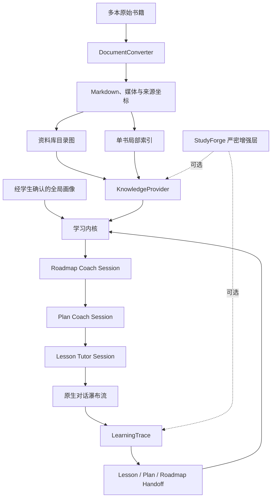
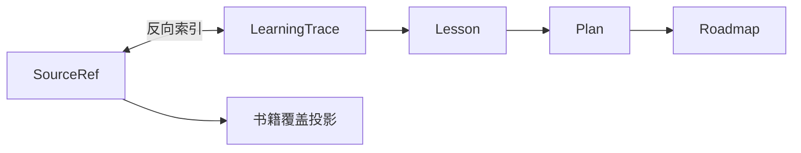

# 通用多书学习内核设计

状态：书面设计稿，待用户审阅

日期：2026-07-31

## 一、结论

本设计不把现有 StudyForge 简单删减成一个“低配版”，也不直接把
OpenMAIC 改造成长期学习系统。新系统先建立一个独立、通用的学习内核：

```text
多本书
  ↓ 转换
Markdown 资料库
  ↓ 自动索引
可检索的外部知识库
  ↓ Coach 问诊与规划
Roadmap → Plan → Lesson
  ↓
Tutor 原生连续对话 + 瀑布流互动内容
  ↓
LearningTrace → Lesson Handoff → Plan Memory → Roadmap Memory
```

通用内核保留 StudyForge 已经验证过的课程节点、父子 Session、按需备课和
分层记忆，但不要求题卡、人工方法图谱、BKT 或庞大的解题证据系统。

未来的 StudyForge 作为高中数学严密增强层接入：

```text
通用学习内核
├── 默认模式
│   ├── Markdown 资料库
│   ├── 自动检索索引
│   └── 活动级 LearningTrace
└── StudyForge Extension
    ├── 题卡
    ├── 解题 Trace
    ├── 方法图谱
    └── BKT 能力投影
```

## 二、为什么要建立新的通用内核

StudyForge 最有价值的部分并不是题卡和 BKT，而是：

- Roadmap、Plan、Lesson 的长期学习组织；
- Coach 与 Tutor 的职责和 Session 隔离；
- 上课前动态备课；
- Lesson、Plan、Roadmap 三层压缩记忆；
- 学生确认后才进入全局长期画像；
- 所有压缩结果都能回到原 Session 和原始资料。

StudyForge 当前最重的部分则来自高中数学的特殊需求：

- 每道题必须先制作真实题卡；
- 题卡必须绑定方法节点；
- 每次作答需要记录正确性、提示依赖、实际方法和更正关系；
- 能力投影需要在题卡、Trace、方法图谱和 BKT 之间持续聚合；
- 维护资产与证据系统本身成为显著成本。

这些要求对数学专题训练有价值，却不适合作为所有学科的默认前提。化学学习可能围绕
方程式和实验现象，历史学习可能围绕史料比较，语文学习可能围绕文本细读，编程学习
可能围绕代码和项目。通用内核需要把“题目作答”提升为更一般的“学习活动”。

## 三、目标与非目标

### 3.1 目标

首版应当做到：

1. 一个资料库可以放置多本书。
2. PDF、EPUB、DOCX 或已有 Markdown 可以转换为带来源位置的 Markdown。
3. 自动索引可以按书、章节、概念区域和原始片段检索资料。
4. 学生导入书籍后不会立即进入课堂，而是先由 Coach 问诊。
5. Coach 根据学生目标、基础、时间和偏好建立 Roadmap 与当前 Plan。
6. Plan 先保存可调整的 Lesson 骨架；每节 Lesson 临近开始时再备课。
7. Tutor 在一个连续聊天界面内完成教学，并可插入题目、视频、图示和互动组件。
8. 系统记录学生实际参与过哪些学习活动，以及这些活动使用了哪些原始资料。
9. Lesson、Plan、Roadmap 形成逐层压缩记忆。
10. 跨课程稳定偏好只有经学生确认后才能进入全局学生画像。
11. 未来 StudyForge 可以逐步迁入，而不需要继续维护第二套课程与记忆内核。

### 3.2 非目标

首版不做：

- 自动把一本书加工成完整的高质量教学资产包；
- 逐题制作题卡；
- 人工维护概念或方法图谱；
- 自动判定 mastery；
- 默认运行 BKT；
- 为每次学习活动建立复杂的 append-only 更正链；
- 把 OpenMAIC 的 Stage、Scene 或独立课堂播放器搬入内核；
- 多用户、班级、教师管理或教育 SaaS；
- Agent 遇到内容后自动生成语义节点、别名或跨书规范化关系。

最后一项明确延期。首版只使用导入时建立的基础索引和学生真实学习产生的
LearningTrace；是否需要“用到哪里，语义精加工到哪里”，等待真实使用问题出现后再
决定。

## 四、设计原则

### 4.1 课程结构与资料结构分离

书本目录不等于学习路径。导入书籍只建立知识库，Roadmap 必须在 Coach 完成问诊后
生成。

### 4.2 Markdown 是可审查资料，索引只是投影

原书、Markdown、页图和课程文件是持久资料；全文、向量和图谱索引都可以删除并
重建。

### 4.3 自动图谱只帮助查找

自动抽取的概念或关系不能直接成为：

- 课程先修关系；
- Roadmap、Plan 或 Lesson 顺序；
- 学生掌握结论；
- 学科权威知识图谱。

Coach 可以参考检索结果，但课程编排仍由 Coach 与学生共同决定。

### 4.4 学习活动是通用证据单位

通用内核不假设每次学习都以做题结束。题目、概念辨析、阅读、视频、实验、讨论、
案例和项目步骤都属于 LearningActivity。

### 4.5 学过不等于掌握

LearningTrace 证明学生实际参与过某项学习活动，并记录当时观察；它不自动证明学生
掌握了相应概念。

### 4.6 越稳定的记忆，范围越大

Lesson 保存具体课堂观察；Plan 保存当前周期变化；Roadmap 保存跨周期认识；只有经
学生确认的稳定偏好才能跨 Roadmap 共享。

### 4.7 不为可能发生的边角问题提前建设重型系统

首版优先建立最小、可替换的接口。运行中尚未出现的问题，不通过新的状态机、数据库
或 Agent 角色提前解决。

## 五、总体架构



系统分为四层：

1. **资料层**：原书、Markdown、媒体、页图和转换报告。
2. **检索层**：资料库目录图、单书局部索引和 KnowledgeProvider。
3. **学习内核**：Roadmap、Plan、Lesson、Session、记忆和权限。
4. **体验层**：Coach/Tutor 对话与 ConversationBlock。

StudyForge Extension 不改变这四层的所有权，只补充学科专用资料与学习观察。

## 六、工作区结构

```text
learning-workspace/
├── library/
│   ├── books/
│   │   ├── chemistry-intro/
│   │   │   ├── BOOK.md
│   │   │   ├── source/
│   │   │   │   └── original.pdf
│   │   │   ├── chapters/
│   │   │   ├── media/
│   │   │   ├── pages/
│   │   │   └── conversion-report.json
│   │   └── another-book/
│   └── .index/
│       ├── catalog/
│       └── books/
│
├── courses/
│   └── chemistry-foundation/
│       ├── ROADMAP.md
│       ├── plans/
│       └── lessons/
│
├── memory/
│   └── student-profile.md
│
└── .runtime/
    ├── sessions/
    └── cache/
```

### 6.1 持久事实

- `library/books/` 中的原书、Markdown、媒体与来源坐标；
- `courses/` 中的 Roadmap、Plan、Lesson、Handoff 和 LearningTrace；
- `memory/student-profile.md` 中经学生确认的跨课程稳定偏好；
- 原始 Coach/Tutor Session。

### 6.2 可重建投影

- `library/.index/`；
- 资料覆盖热力图；
- 当前续学入口；
- Lesson、Plan 和 Roadmap 的进度视图；
- 从资料反查课程的反向索引；
- UI 缓存。

## 七、书籍导入

### 7.1 导入流程

```text
选择原始文件
→ 计算 source revision
→ 解析目录、页面、文本、公式、表格与图片
→ 生成 BOOK.md 和章节 Markdown
→ 为原始片段分配稳定 SourceRef
→ 保存页图与转换质量信息
→ 建立单书局部索引
→ 更新资料库目录图
```

默认转换器可采用 [Docling](https://github.com/docling-project/docling)，但内核只依赖
DocumentConverter 接口，不依赖具体实现。

```ts
interface DocumentConverter {
  inspect(input: OriginalDocument): Promise<DocumentInspection>;
  convert(input: OriginalDocument): Promise<ConvertedBook>;
}
```

### 7.2 SourceRef

导入器为可引用的原始片段分配稳定、不可由模型编造的标识：

```yaml
source_ref: "book:chemistry-intro:span:p0087-eq03"
book_id: "chemistry-intro"
path: "library/books/chemistry-intro/chapters/ch04.md"
anchor: "p0087-eq03"
physical_page: 87
kind: "equation"
source_revision: "sha256:..."
```

SourceRef 可以指向：

- 段落；
- 公式或化学方程式；
- 图片或图注；
- 表格；
- 例题；
- 视频或音频片段；
- 其他转换器能够稳定定位的资料对象。

模型只选择检索结果中已经存在的 SourceRef，不能手写路径或猜测标识。

### 7.3 转换质量

不同书籍允许使用不同解析器。转换失败或低置信不直接阻止入库：

- Markdown 是日常检索文本；
- 原文件永久保留；
- 复杂 PDF 可保留逐页图片；
- `conversion-report.json` 记录可能存在的 OCR、公式、表格或阅读顺序问题；
- 命中低置信片段时，KnowledgeProvider 同时返回原页或媒体供 Agent 核对。

转换质量报告不升级为人工审核工作台，也不要求用户逐页确认。

## 八、两级知识索引

### 8.1 为什么不使用一张全库大图

一个资料库可能包含数学、化学、历史和编程书籍。把全部片段放入一张无边界图会造成：

- 无关概念相互污染；
- Roadmap 难以限定可使用资料；
- 删除或更新一本书影响整个索引；
- 图谱关系逐渐被误认为课程关系。

### 8.2 资料库目录图

目录图只负责路由到可能相关的书与章节，包含：

- 书籍；
- 章节；
- 自动概念标签；
- 书与章节的包含关系；
- 跨书“可能相关”连接。

目录图不保存学生学习状态，也不拥有完整原文。

### 8.3 单书局部索引

每本书拥有独立局部索引，保存：

- Markdown 片段与 SourceRef；
- 全文和向量表示；
- 自动抽取的概念与关系；
- 图片、公式、表格等媒体位置；
- 原文引用信息。

新增或重新转换一本书时，只重建该书局部索引并更新目录图。

### 8.4 Roadmap 资料范围

每个 Roadmap 保存可调整的 `source_scope`，其中可以包含一本或多本书。Coach 默认只
能检索该范围。

扩大范围由 Coach 提议、学生确认；Lesson 不自行扩大范围。

### 8.5 查询流程

```text
教学意图
→ 根据 Roadmap 限定允许书籍
→ 查询资料库目录图
→ 选择候选书籍与章节
→ 并行查询对应单书局部索引
→ 合并和重排
→ 返回 ContextPacket
```

首版可以使用 [LightRAG](https://github.com/HKUDS/LightRAG) 实现局部图和混合
检索，但必须通过 KnowledgeProvider 隔离：

```ts
interface KnowledgeProvider {
  catalogSearch(input: CatalogSearchInput): Promise<CatalogCandidate[]>;
  search(input: KnowledgeSearchInput): Promise<ContextPacket>;
  open(sourceRef: string): Promise<ResolvedSource>;
  rebuild(scope: RebuildScope): Promise<RebuildReceipt>;
}
```

`ContextPacket` 至少包含：

- 真实 SourceRef；
- 命中片段；
- 召回理由；
- 书名、章节和页码；
- 邻近概念或关系线索；
- 转换质量提示；
- 打开原始资料所需的解析信息。

它不直接返回课程顺序、掌握结论或无来源答案。

## 九、课程节点与 Session

课程结构继承 StudyForge 已验证的 Roadmap、Plan、Lesson 三层：

```text
Roadmap Coach Session
  └── Plan Coach Session
      ├── Lesson 001 Tutor Session
      ├── Lesson 002 Tutor Session
      └── Lesson 003 Tutor Session
```

### 9.1 Roadmap

Roadmap 负责：

- 长期学习目标；
- 可观察能力标准；
- Roadmap 资料范围；
- 多个 Plan 的编排；
- 跨 Plan 回顾；
- 与学生讨论下一学习周期。

书籍导入完成不会自动创建 Roadmap。Roadmap Coach 必须先询问目标、基础、可用时间和
关键限制。

### 9.2 Plan

Plan 是一个可复盘的学习周期，负责：

- 当前周期目标；
- Lesson 骨架；
- 当前位置；
- 周期内观察与记忆；
- 下一 Lesson 的备课判断；
- 周期结束后的总结。

建立 Plan 时只生成可调整的 Lesson 骨架，不一次性生成全部课堂内容。

### 9.3 Lesson

Lesson 是一次独立课堂，负责：

- 当前学习目标；
- LearningActivity 骨架；
- 备课选定的资料和关键互动；
- Tutor Session；
- 学生实际参与后的 LearningTrace；
- Lesson Handoff。

### 9.4 控制权

- 父节点可以规划尚未激活的子节点。
- 子节点激活后，由自己的 Session 掌控。
- Tutor 不修改 Plan 或 Roadmap。
- Lesson 结束后回到原 Plan Coach Session。
- Plan 结束后回到 Roadmap Coach Session。
- 学生保留结束 Lesson、重排计划和改变学习方向的最终决定权。

## 十、上下文装配

每个 Session 只读取与自身任务相称的上下文：

```text
节点专属提示词
+ 当前节点 Markdown
+ 直接父级 Handoff
+ 必要的祖先目标摘要
+ 经学生确认的全局学生画像
+ 本轮 KnowledgeProvider 返回的 ContextPacket
```

不复制其他 Session 的完整聊天记录。

### 10.1 Roadmap Coach

读取：

- ROADMAP.md；
- 各 Plan Handoff；
- 全局学生画像；
- Roadmap 允许资料的目录级检索结果；
- 需要核查时的下层来源。

### 10.2 Plan Coach

读取：

- 当前 Plan；
- Roadmap 目标摘要；
- 当前 Plan 内已有 Lesson Handoff；
- 全局学生画像；
- 当前资料范围；
- 备课检索结果。

### 10.3 Tutor

读取：

- 当前 Lesson；
- Plan 为本课提供的 Handoff；
- 与本课直接相关的全局偏好；
- 当前 Lesson 已绑定或临场检索的资料；
- 当前 Tutor Session 历史。

Tutor 不默认读取其他 Lesson 的完整对话。需要细节时，通过 Handoff 中的来源索引
回到原 Lesson 或 Session。

## 十一、多层记忆

### 11.1 Lesson Handoff

Lesson 结束时形成：

- 本课实际进行了什么；
- 关键 LearningTrace；
- 学生当前理解、困难或新发现；
- 使用了哪些教学方式；
- 下一课值得注意什么；
- 对应 Session 与 SourceRef。

### 11.2 Plan Memory

Plan 汇总本周期 Lesson Handoff，形成：

- 周期内发生的变化；
- 哪些策略在什么条件下有效；
- 哪些判断仍不稳定；
- 仍需解决的问题；
- 下一周期建议；
- 来源 Lesson。

### 11.3 Roadmap Memory

Roadmap 汇总多个 Plan，形成：

- 长期方向与阶段变化；
- 跨周期仍然成立的认识；
- 新 Plan 的规划依据；
- 当前结论的边界；
- 来源 Plan。

### 11.4 全局学生画像

不同 Roadmap 之间只共享稳定学习偏好，例如：

- 更适合先尝试再讲解；
- 对连续长讲解容易疲劳；
- 更偏好图示还是文字；
- 何种互动节奏更自然。

学科内容、具体薄弱点和阶段判断留在对应 Roadmap。

Lesson 到 Plan、Plan 到 Roadmap 的压缩自动完成；进入全局学生画像前必须由学生逐条
确认。

### 11.5 来源链

三层记忆必须保留来源：

```text
全局偏好候选
→ Roadmap Memory
→ Plan Memory
→ Lesson Handoff
→ LearningTrace
→ Tutor Session 与 SourceRef
```

来源链用于核查和重新理解，不升级为 StudyForge 式重型证据裁决系统。

## 十二、LearningActivity 与 LearningTrace

### 12.1 通用学习单位

LearningActivity 可以是：

- 讲解后的追问；
- 概念辨析；
- 阅读与复述；
- 视频观看后的解释；
- 实验预测、观察与讨论；
- 案例分析；
- 题目作答；
- 模拟器操作；
- 项目步骤；
- 其他能够产生真实学生参与的活动。

内核不维护一份封闭、穷尽的活动枚举。活动类型只需要能够声明：

- 如何呈现；
- 什么行为算真实参与；
- 可选的活动专用结果；
- 使用了哪些 SourceRef。

### 12.2 LearningTrace 的最小公共契约

```yaml
id: "learning-trace-..."
activity_ref: "lessons/lesson-003.md#activity-02"
session_ref: "session:...#message-31"
occurred_at: "..."
participation: "completed | partial"
source_refs:
  - "book:chemistry-intro:span:p0087-eq03"
observation: "学生能够写出反应式，但混淆催化剂与平衡移动。"
activity_result:
  # 可选，由活动类型拥有；核心不解释其全部字段
```

通用字段只回答：

- 学生实际参与了哪项活动；
- 活动使用了哪些原始资料；
- 活动发生在哪个 Session；
- 当时观察到了什么。

数学题可以在 `activity_result` 中追加正确性、提示依赖和实际方法；概念辨析、实验、
阅读或项目活动可以使用不同结果结构。

### 12.3 写入时机

只有发生真实学生参与时才写 LearningTrace：

- 学生提交回答；
- 学生参与讨论或辨析；
- 学生完成阅读、视频或实验活动约定的参与动作；
- 学生操作互动组件并产生结果；
- 学生完成或部分完成项目步骤。

以下行为不写 LearningTrace：

- Coach 私下检索；
- Coach 备课查看资料；
- Tutor 仅把内容显示在界面；
- 尚未产生学生参与的预加载互动块。

### 12.4 来源绑定

Material-based Activity 使用的 SourceRef 来自：

- Coach 备课选定的 ContextPacket；
- Tutor 临场检索返回的真实 ContextPacket；
- 已经绑定在 ConversationBlock 上的真实引用。

模型不能直接填写书名、路径、页码或新的 SourceRef。

纯反思、学习方向讨论等不依赖教材的活动可以没有 SourceRef，但不会贡献资料覆盖。

### 12.5 更正

通用内核不复刻 StudyForge 的 append-only supersede 系统。Lesson 拥有自己的
LearningTrace；明确发现记录错误时直接更正 Lesson 中的记录和对应 Lesson Handoff，
再重建资料覆盖等投影。更高层的 Plan 或 Roadmap Memory 通过下一次正常父级复盘修订，
不触发跨层自动连锁改写。

需要审计级不可变历史的学科，可以由扩展层另行提供。

## 十三、资料学习覆盖

资料覆盖从 LearningTrace 派生，不建立第二套事实。



支持的查询包括：

- 某个 SourceRef 在哪些 Lesson 中被实际学习过；
- 某节 Lesson 使用了哪些书、章节、页面和片段；
- 某本书哪些片段已经进入学习活动；
- 某一页有多少片段被学习过；
- 同一片段是否在不同周期中复习过；
- 哪些资料尚未进入学习过程。

一页只聚合真实命中的片段。学过一个公式不会把整页标记成完成。

覆盖投影不能显示为掌握度；做错、混淆或部分完成的活动仍然属于已经学习过，但其
LearningTrace 观察不同。

## 十四、原生对话课堂

通用版不使用 OpenMAIC 的独立 Classroom、Stage 或 Scene。课堂保持为一个连续的
Tutor 对话流：

```text
Tutor 讲解
→ 可交互问题
→ 学生作答
→ Tutor 追问
→ 动态图示或视频
→ 继续自然对话
```

### 14.1 ConversationBlock

聊天流允许插入结构化内容：

```ts
type ConversationBlock =
  | TextBlock
  | MediaBlock
  | QuestionBlock
  | InteractiveBlock;
```

公共外壳包含：

```ts
interface ConversationBlockBase {
  id: string;
  sourceRefs: string[];
  fallbackMarkdown?: string;
}
```

OpenMAIC 可以作为互动形式、生成提示和现有组件的参考，但不成为内核运行时依赖。

### 14.2 生成时机

采用混合策略：

- Coach 备课时准备关键互动和所需素材；
- Tutor 到达对应活动时决定是否使用；
- Tutor 可以根据学生表现跳过、重排或补充轻量互动；
- 不在 Plan 创建时生成全部 Lesson 互动内容。

### 14.3 退化策略

互动组件无法生成或运行时，使用 `fallbackMarkdown` 继续课堂。互动失败不改变课程
事实，也不阻断 Tutor Session。

首版优先使用注册组件；任意生成 HTML 如需支持，应在独立沙箱中运行，不作为第一版
必要条件。

## 十五、Agent 职责

### 15.1 Coach

Coach 在 Roadmap 或 Plan 范围内：

- 进行有洞见的问诊；
- 与学生确定目标；
- 编排 Plan 和 Lesson 骨架；
- 检索 Roadmap 允许的资料；
- 准备当前 Lesson；
- 阅读 Handoff 和 LearningTrace；
- 复盘并调整后续安排；
- 提出全局长期偏好候选。

### 15.2 Tutor

Tutor 在单个 Lesson 范围内：

- 推进当前 LearningActivity；
- 进行自然多轮教学；
- 插入或调整 ConversationBlock；
- 根据学生真实参与写 LearningTrace；
- 形成 Lesson Handoff；
- 把课程结束主动权交还给学生。

### 15.3 知识库不是 Agent

KnowledgeProvider 只检索和解析资料，不生成课程决定。首版不增加长期运行的知识图谱
维护 Agent。

## 十六、关键数据流

### 16.1 从书籍到 Roadmap

```text
导入多本书
→ 生成 Markdown 和索引
→ 学生选择想学的主题
→ Roadmap Coach 问诊
→ 确定 source_scope
→ 写入 Roadmap
→ 创建当前 Plan
```

### 16.2 从 Plan 到 Lesson

```text
Plan 目标与 Lesson 骨架
+ 前课 Handoff
+ 全局偏好
+ KnowledgeProvider 资料包
→ Coach 备课
→ 写 Lesson
→ 学生进入 Tutor Session
```

### 16.3 从课堂到记忆

```text
学生参与 LearningActivity
→ Tutor 写 LearningTrace
→ Lesson 结束并形成 Handoff
→ Plan Coach 复盘
→ 下一 Lesson 重新备课
→ Plan 完成后形成 Plan Memory
→ Roadmap 决定下一周期
```

### 16.4 从资料到覆盖

```text
LearningTrace.source_refs
→ 反向索引
→ SourceRef ↔ Lesson
→ 聚合到章节和页面
→ 生成资料学习覆盖视图
```

## 十七、失败处理

### 17.1 转换失败

- 保留原文件；
- 标记失败页或失败章节；
- 允许重新选择转换器；
- 不生成伪造 Markdown；
- 已成功转换部分可以继续使用。

### 17.2 索引失败

- Markdown 和课程文件不受影响；
- 允许重建单书索引；
- 单书图不可用时可以退化为标题、全文或向量搜索；
- 不因为索引结果为空而编造资料。

### 17.3 来源解析失败

- KnowledgeProvider 返回明确失败；
- Coach/Tutor 不猜测路径或 SourceRef；
- 低置信内容优先打开原页核对。

### 17.4 互动组件失败

- 使用 fallback Markdown；
- 不写虚假的学生参与记录；
- 学生真正完成退化后的活动时，仍可写 LearningTrace。

### 17.5 记忆压缩不确定

- 保留来源链；
- 上层 Handoff 可以表达“不确定”或“尚不能判断”；
- 不把单次活动升级为稳定能力；
- 进入全局画像前由学生确认。

## 十八、与 OpenMAIC 的关系

OpenMAIC 可借鉴的部分：

- 互动内容形态；
- 测验、图示、视频和模拟组件；
- 内容生成提示；
- 富媒体渲染经验。

不复用为核心的部分：

- 一次性生成完整课堂；
- Stage/Scene 播放模型；
- 独立 Classroom 页面；
- 为展示而建立的多 Agent 导演流程；
- 把课堂内容与长期课程状态绑定在同一结构中。

通用内核的主体验始终是 Coach/Tutor 原生对话，互动内容只是消息流中的块。

## 十九、StudyForge 的未来迁移

迁移目标不是让通用版兼容 StudyForge 的所有旧格式，而是逐步让 StudyForge 使用同一
内核。

### 19.1 可直接复用

- Roadmap、Plan、Lesson；
- 父子 Session；
- 按需备课；
- Handoff；
- 全局画像确认；
- 原生对话课堂；
- SourceRef 与资料覆盖。

### 19.2 作为扩展迁入

```text
StudyForge Card Provider
→ 扩展 KnowledgeProvider

StudyForge Problem Activity
→ 扩展 LearningActivity

StudyForge Attempt Trace
→ 扩展 LearningTrace.activity_result

StudyForge Method Graph
→ 提供人工维护的高精度知识关系

StudyForge BKT
→ 读取专用 Trace 的可重建能力投影
```

通用内核不理解 primary method、secondary method、correctness 或 BKT；StudyForge
Extension 自己解释这些字段。

### 19.3 迁移顺序

1. 先独立实现通用资料库、课程节点、记忆与 LearningTrace。
2. 用至少两个非数学主题验证通用性。
3. 把 StudyForge 的课程与 Session 接到通用内核。
4. 再把题卡、解题 Trace、方法图谱和 BKT 作为扩展接入。
5. 只有新内核真实覆盖旧能力后，才收缩旧实现。

## 二十、复杂度预算

首版新增的必要抽象只有：

```text
DocumentConverter
KnowledgeProvider
LearningActivity
LearningTrace
ConversationBlock
```

不引入：

- 通用工作流编排平台；
- 任意插件市场；
- 后台语义精加工队列；
- 统一事实数据库；
- 学科无关 mastery 引擎；
- 自动课程知识图谱；
- 多层 Trace supersede 状态机。

LightRAG、Docling 或其他实现都位于接口后面。替换它们不应改变课程、记忆和
LearningTrace 文件。

### 20.1 实施拆分

本文是总架构设计，不要求用一个大改动同时完成所有模块。实施应拆成四个可独立验收
的纵向切片：

1. **多书资料库**：转换、SourceRef、原文回溯和单书基础检索。
2. **两级索引**：资料库目录图、Roadmap 资料范围和 KnowledgeProvider。
3. **学习闭环**：Roadmap、Plan、Lesson、Session、LearningActivity、LearningTrace
   与三层 Handoff。
4. **原生互动课堂**：ConversationBlock、关键互动备课和 Tutor 临场调整。

StudyForge Extension 属于上述四项稳定后的后续迁移，不进入通用版首轮实施计划。

## 二十一、验收标准

### 21.1 多书资料库

- 导入至少两本不同格式的书；
- 生成章节 Markdown、SourceRef 和转换报告；
- 删除索引后可以从原书与 Markdown 重建；
- Roadmap 只检索声明范围内的书。

### 21.2 课程闭环

- Coach 先问诊，再生成 Roadmap 与当前 Plan；
- Plan 显示 Lesson 骨架；
- Lesson 在开始前结合最新 Handoff 与资料重新备课；
- 学生可以结束、调整或重排课程。

### 21.3 原生课堂

- 同一 Tutor 对话中可以自然穿插文字、题目、媒体和互动块；
- 关键互动来自备课，Tutor 可以临场调整；
- 互动失败可以退化为 Markdown；
- 不需要进入独立 Classroom 页面。

### 21.4 LearningTrace

- Coach 私下检索不写 LearningTrace；
- Tutor 仅显示资料不写 LearningTrace；
- 学生实际参与活动后才写；
- Trace 可以指回真实 Session、Activity 和 SourceRef；
- 数学题、概念辨析、阅读和实验活动可以使用同一公共外壳。

### 21.5 资料覆盖

- 从书籍片段可以反查真实 Lesson；
- 从 Lesson 可以查看实际使用的资料；
- 页面覆盖只聚合真实学习过的片段；
- 覆盖不显示为掌握度。

### 21.6 记忆连续性

- 新 Lesson 能读取前课 Handoff，但不复制前课完整聊天；
- 新 Plan 能读取前一 Plan 的压缩结果；
- 不同 Roadmap 不共享学科判断；
- 全局偏好经学生确认后可以跨 Roadmap 使用；
- 每层记忆可以逐级回到原始 LearningTrace 与 Session。

### 21.7 多学科验证

至少使用两个不同形态的学习周期验证：

- 化学：方程式、实验现象或概念辨析；
- 历史、语文、物理或编程中的一种非题卡主导学习。

验收目标是验证功能闭环和通用性，不以一次模拟课程证明教育效果。

## 二十二、明确延期

以下设计等待真实问题出现后再讨论：

- Agent 遇到内容后的动态 KnowledgeAnchor；
- 自动生成别名和规范名称；
- 跨书实体自动合并；
- 后台语义精加工 Worker；
- 自动复习调度；
- 通用 mastery 或能力图；
- 云端、多用户和协作；
- 原始 StudyForge 全量迁移。

## 二十三、最终判断

这套架构保留了 StudyForge 已经证明有价值的长期课程治理，又去掉了高中数学专用资产
成为系统前置条件的问题。

它的核心不是“把书转成 Markdown 后马上聊天”，而是：

```text
把多本书变成可追溯、可检索的外部知识库
→ 通过 Coach 问诊形成真正属于学生的课程
→ 用 Lesson 级原生对话完成具体学习
→ 用 LearningTrace 记录学生实际学过什么
→ 用三层记忆支撑之后的持续个性化
```

StudyForge 以后可以成为这套通用内核上的高精度数学模式，而不再承担所有学科都不
需要的默认复杂度。
