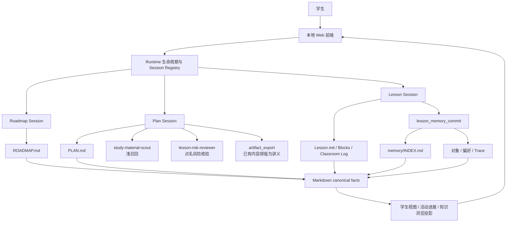
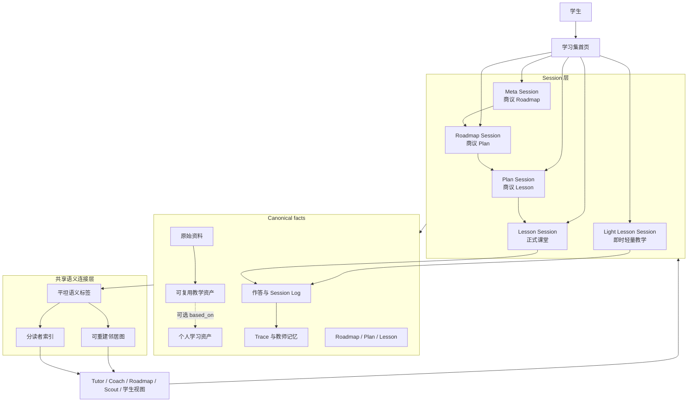

# StudyForge M1b 北极星总架构：当前系统与目标系统

**状态：** 北极星架构，供设计审计；不是实施计划

**日期：** 2026-08-08

**当前实现基线：** `a3c4a75`

**目标范围：** 完整 M1b.1–M1b.4

## 一、这份文档回答什么

StudyForge 不是一个围绕聊天记录增加若干功能的教育 Chatbot。它试图成为一个长期教学
工作台：教师 Agent 不仅交付答案，还要和学生共同改变学生能够看见、解释、比较和完成的
事情；课程、学习资产和教师记忆共同保存这段变化，但不能互相冒充。

这份文档提供两个完整快照：

1. **当前系统：** 截至基线提交，M0 课程循环和 M1a 教师记忆已经能够运行的形态；
2. **M1b 北极星：** M1b.1–M1b.4 全部完成后，学习集可以怎样从空白、原始资料、讨论或
   他人的教学资产中生长。

两个快照都说明：

- 学生怎样进入系统并完成一次学习；
- 每种 Session 负责什么；
- 哪类文件拥有哪类事实；
- 模型、Runtime、子 Agent 和前端如何协作；
- 信息怎样进入上下文，又怎样在课后成为可召回记忆。

最后的“待澄清接口”只记录尚未完成的设计问题，不代表已经批准的解决方案。

### 1.1 状态标记

| 标记 | 含义 |
| --- | --- |
| 当前事实 | 已经存在于当前 Runtime、Skill、前端或 Markdown 契约中 |
| 北极星决策 | 已在 M1b 设计中确认，属于完整 M1b 的目标形态 |
| 待澄清 | 已发现真实张力，但还没有形成最终设计 |

### 1.2 五个核心名词

- **学习集（Learning Set）：** 承载某个学生在一个学习领域内的资料、课程、资产、活动与
  记忆的容器；它本身不是一个课程节点。
- **Session：** 一段有明确责任边界的师生或教师内部工作过程，拥有独立 Pi 对话历史。
- **教学资产：** 可以跨课堂或跨学生复用的题目、材料和教师教学依据。
- **个人资产：** 学生可见、可继续修改和使用的 Note、Flashcard 与个人题卡。
- **教师记忆：** 教师为了未来判断而保存的学习痕迹、对象状态、能力假设和明确偏好；它
  不是个人资产，也不是聊天摘要。

## 二、贯穿两个快照的承重原则

下面这些原则既是当前 M0/M1a 的基础，也是 M1b 不能破坏的约束。

### 2.1 教学的结果不是“产物数量”

一张卡、一个 Plan 或一份讲义只说明某个外部对象被创建。学生是否形成理解，必须回到其
真实作答、解释、比较、迁移和所获帮助。系统不能用“文件存在”代替“学生学会”。

### 2.2 一个事实只有一个持久所有者

- 题干和标准答案属于教师题卡；
- 学生实际说过或做过什么属于来源 Session Log 或作答记录；
- 学生自己的整理属于个人资产；
- 教师当前怎样理解学生属于对象记忆或能力假设；
- 图谱、导航、反向链接和召回表属于可重建投影。

同一事实可以为不同读者生成不同视图，但不能维护多份彼此可能漂移的真相。

### 2.3 语义判断与机械权威分开

模型负责不可约的教学语义，例如课程目标、讲解、题目适配性、学生表现意义和标签词语。
Runtime 负责学习集、Session、身份、路径、时间、revision、来源绑定、权限、原子写入和
投影重建。模型不猜路径和 ID，Runtime 不判断学生是否掌握。

### 2.4 学生参与改变教学方向的决定

Roadmap、Plan、Lesson 的实质目标和安排由教师先形成专业判断，再与学生讨论。影响长期
方向、阶段承诺、课堂目标或明显学习体验的改变需要学生明确确认；普通课堂调整由教师承担。

### 2.5 渐进式披露代替全量上下文

新 Session 只获得自己的身份、角色、教学契约和紧凑导航。需要历史时先读压缩后的当前
判断，再沿稳定引用下钻 Trace，最后才读取原始课堂 Log。题库、原始资料和个人资产也只在
眼前动作需要时召回，不能全部常驻上下文。

## 三、快照 A：当前已经运行的 StudyForge

### 3.1 当前产品边界

当前 StudyForge 是一个本地、单学习者、Markdown-first 的 Pi 教学工作台。它面向已经具备
课程骨架和教学资源的学习集：`LEARNING_GUIDE.md` 与 `ROADMAP.md` 是启动前提，课程沿
Roadmap → Plan → Lesson 生长。

当前系统已经具备：

- 三层独立 Session 和明确的生命周期；
- 多课组成的动态 Plan；
- Block 级课堂预案、学生视图、教师控制与真实日志；
- 题卡召回、局部风险核验和可打印讲义；
- M1a 教师笔记记忆及渐进式召回；
- 结构化、节点绑定的课堂和记忆写入；
- 学生界面、工具进展投影和可选教师人格表现层。

当前系统还不具备：

- 没有 Roadmap 的真正空白学习集；
- 不属于 Plan 的 Light Lesson；
- 学生自己的 Note、Flashcard 和个人题卡；
- 独立题卡作答历史和答案查看流程；
- 从原始书籍按学习需要持续生长资产；
- 导入、发布和分享学习资产的完整边界。

### 3.2 当前运行拓扑



Pi Session 保存连续对话，Markdown 保存跨 Session 仍须成立的教学事实。前端刷新或重新
打开节点时，Runtime 根据节点 frontmatter 中的 `session_id` 找回正确 Session；聊天历史
不会被复制到父子节点。

当前学习集的主要物理结构是：

```text
learning-set/
├── LEARNING_GUIDE.md
├── ROADMAP.md
├── plans/<plan-id>/
│   ├── PLAN.md
│   └── lessons/<lesson-id>.md
├── memory/
│   ├── INDEX.md
│   ├── indexes/
│   ├── objects/
│   ├── capabilities/
│   └── preferences/
├── cards/
├── graph/
├── materials/
└── .studyforge/                 # 只保存 Runtime 状态
```

### 3.3 当前课程 Session

| Session | 时间尺度 | 直接产物 | 主要责任 | 明确不负责 |
| --- | --- | --- | --- | --- |
| Roadmap | 较长学习周期 | 下一个 Plan | 诊断长期方向、讨论能力变化、校准跨 Plan 判断 | 具体备下一课、现场授课 |
| Plan | 一个阶段、多节课 | 下一节 Lesson | 把阶段目标转成动态课程序列，课后根据证据调整 | 改写 Roadmap、替学生决定所有安排 |
| Lesson | 一次正式课堂 | Block Log、Trace、必要资产输出 | 授课、支架、检验、记录实际发生、课末固化 | 改写 Plan 目标、读取无关课程证据 |

父层只设计自己的直接子层：Roadmap 创建 Plan，Plan 创建 Lesson，Lesson 不继续创建另一
层课程。一个 Plan 通常可以包含约五至六节一小时课程，但数量只是初始估计；完成条件来自
阶段能力证据，不来自凑够课次。

当前课程循环是：

```text
Roadmap 与学生确认阶段方向
→ 写入并准备 Plan
→ 学生开始 Plan
→ Plan 与学生讨论下一节课
→ 写入并准备 Lesson
→ 学生开始 Lesson
→ Tutor 上课并记录 Block Log
→ 课末固化 Trace 与教师记忆
→ 学生关闭 Lesson
→ Plan 读取新证据并讨论下一课
→ 达到标准后完成 Plan
→ Roadmap 复盘并制定下一个 Plan
```

### 3.4 当前正式课堂

每个 Lesson 至少有一个 Block。Block 同时保存四类不同信息：

- `Node State`：活动类型、依赖、状态与明确绑定的 `Uses`；
- `Student View`：学生当前可以看见的题目、材料或任务；
- `Teacher Control`：备课时决定但不向学生直接展示的教学路线；
- `Classroom Log`：课堂中按顺序真实发生的表现、帮助、修正与结果。

Tutor 只管理当前 Lesson 的 Block，不修改 Lesson 顶层生命周期，也不搜索兄弟 Lesson 或
目录中的孤立文件。学生的当前表现优先；预案外情况确实影响眼前教学动作时，Tutor 才沿
记忆索引按需召回。

### 3.5 当前备课、检索、核验和讲义

Plan Coach 负责最终备课判断，两个子 Agent 只承担窄任务：

- `study-material-scout` 根据 Coach 给出的材料意图，从已有教学资产中做特征召回和浅核验；
- `lesson-risk-reviewer` 只核验 Coach 已点名、确有实质风险的题目或路线，不重写整课。

Scout 找到调用者要求数量的合格候选即可停止，不寻找全局最优。Coach 读取少量决赛材料，
承担最终数学、来源和教学作用核验。备课完成后，如果学生明确需要讲义，`artifact_export`
只把已经批准的 Lesson `Student View` 排版成可打印页面，不生成新的教学内容。

### 3.6 当前 M1a 教师记忆

当前记忆不是聊天摘要，也不是一个不断膨胀的学生画像。它分成：

| 层 | 持有内容 | 主要读者 |
| --- | --- | --- |
| 来源 Lesson | Block Log 与一次课末形成的完整 Trace | 核查者、需要下钻的教师 |
| 对象记忆 | 某个知识对象当前学到哪里、流变概述、边界与 Trace 时间线 | Tutor、Coach、Roadmap |
| 能力假设 | 跨不同知识对象重复出现的学习方式及其适用边界 | Coach、Roadmap |
| 偏好 | 学生明确表达或多次确认的互动需求及其范围 | 各教学角色 |
| `memory/INDEX.md` | 当前学习前沿和稳定文件入口 | 新 Session 的常驻导航 |

课堂中先即时记录原始事实；正式课末反思后，Tutor 把有未来价值的过程压缩为 Trace，并
局部更新对象记忆和明确偏好。Coach 只有看到同一模式跨不同对象出现后，才形成工作能力
假设；Roadmap 在跨 Plan 回流时继续校准。

召回顺序是：

```text
memory/INDEX.md
→ 对象 / 能力 / 偏好当前判断
→ 来源 Lesson 中的 Trace
→ 只有关键差异仍无法核查时读取 Block Log
```

旧记忆只能帮助选择当前动作，不能覆盖学生眼前表现。教学待办留在 Plan 或 Roadmap，不能
伪装成学生认知特征。

### 3.7 当前模型与 Runtime 的分工

| 参与者 | 当前拥有的责任 |
| --- | --- |
| Roadmap / Coach / Tutor 模型 | 问诊、教学判断、方案、解释、标签或对象语义、学生可见语言 |
| Runtime | 当前节点、父子归属、状态转换、工具权限、ID、路径、原子写入、Session 恢复 |
| Scout | 只读已授权教学资产，返回所需数量的候选和浅风险 |
| Reviewer | 只核验点名风险，不接管 Coach 的整课判断 |
| 前端投影 | 展示学生可见文档、对话、活动进展和打印内容，不展示 CoT 与教师私有依据 |

主模型上下文由少量常驻契约和按 Session 装载的能力组成：共享文档契约、学习指南、教学
核心、可选人格和当前节点身份提供稳定底座；Roadmap、Plan、Lesson 各自只装载一个根
Skill。首次进入、课后复盘、Plan 收口、材料准备和风险核验等 reference 只在相应阶段读取。
子 Agent 使用新的隔离上下文，只获得自足 brief 和其任务所需的教学资产，不继承父对话。

可选教师人格只改变面向学生的表达气质，不改变角色职责、证据边界或写入权限。

### 3.8 当前系统实例：学生想预习化学反应原理

学生林然已经进入一个由教师预先准备好的“化学反应原理”学习集。这个学习集已有
`ROADMAP.md`、题卡、材料和词表。林然只知道自己“一到综合题就不知道用哪个平衡关系”，
无法准确说出缺口。

1. **Roadmap 问诊。** Roadmap 询问学习目的、现有基础、考试时间和典型卡点；必要时用
   两个短探针区分“不会写平衡表达式”和“不会根据体系选择模型”。
2. **形成 Plan。** 师生确认第一个 Plan 聚焦“从体系组成识别平衡模型，并解释表达式中
   各物质的地位”。初步预计五节课，但允许根据表现增减。
3. **准备第一课。** Plan 与学生商量先从 Ksp 与一般平衡常数的差异进入。Coach 请 Scout
   找两道符合目标的题，读取候选并准备 Lesson；对其中一处答案边界有疑问时才调用
   Reviewer。
4. **正式授课。** Tutor 展示一个含固体的沉淀溶解情境。林然一开始把固体也写进表达式；
   Tutor 通过体系中“活度近似保持不变”的地位逐步解释，再让他独立处理一个外观不同的
   气固平衡。
5. **留下证据。** Block Log 记录首次表现、实际帮助和迁移结果；课末 Trace 写明林然已能
   在明确体系中解释为何纯固体不进入表达式，但尚未证明能在复杂混合体系中自主识别。
6. **下一课调整。** Plan Session 先读对象记忆和新 Trace，再决定下一课是否进入离子共存、
   条件平衡或继续做一次独立辨别。

这个系统已经能完成有层级、会复盘、根据真实证据继续生长的正式课程。但如果林然只想
临时问一句“Ksp 为什么只乘离子浓度”，当前系统仍要求他处在既有 Roadmap、Plan 和 Lesson
中；这正是 M1b 要补上的入口与资产层。

## 四、快照 B：完整 M1b 后的北极星架构

### 4.1 北极星产品形态

M1b 完成后，学习集首先是一个能够生长的载体，而不是一棵必须预先存在的课程树。它可以
从四种真实入口开始：

1. 学生没有任何资料，只带着一个问题来讨论；
2. 学生投入一本书、PDF、图片、讲义或零散题目；
3. 学生导入他人公开的教学资产和标签词表；
4. 学生已经有正式课程，继续在课程与临时问题之间往返。

课程仍然重要，但课程从学习集里产生。一次随口提问不必先建立 Roadmap；只有当学生希望
形成长期学习承诺时，Meta Session 才与学生商议并创建 Roadmap。

### 4.2 北极星总拓扑



图中的箭头不都表示持久关系。原始资料、资产、活动、课程和记忆拥有事实；索引、邻居图和
读者视图都可以从这些事实重建。

完整 M1b 的逻辑目录如下。M1b.1 已确认的路径保持具体；原始资料和发布包的内部切片方式
仍由 M1b.3、M1b.4 的实施设计细化，不影响这里的所有权分层。

```text
learning-set/
├── LEARNING_GUIDE.md
├── ROADMAP.md                    # 可选；由 Meta Session 创建
├── plans/<plan-id>/              # Roadmap 存在后才可能出现
│   ├── PLAN.md
│   └── lessons/<lesson-id>.md
├── light-lessons/<light-id>.md
├── sources/                       # 原始书籍、PDF、图片、讲义及来源信息
├── cards/                         # 既有或新建的教师题卡
├── materials/                     # 可复用教学材料
├── personal/
│   ├── notes/
│   ├── flashcards/
│   └── problems/
├── activity/problem-attempts/
├── memory/
│   ├── INDEX.md
│   ├── indexes/
│   ├── objects/
│   ├── capabilities/
│   └── preferences/
├── features/vocabulary.yaml       # 新资产共享的动态语义词表
├── graph/                          # 旧图谱与可重建查询投影
└── .studyforge/                    # 仍然只保存 Runtime 状态
```

### 4.3 完整 Session 层级

| Session | 是否依赖课程树 | 直接设计的下一层 | 主要功能 |
| --- | --- | --- | --- |
| Meta | 否，绑定学习集根 | Roadmap | 讨论为何学习、长期变化、总体学习方式，确认后创建 Roadmap |
| Roadmap | 是 | Plan | 在长期尺度诊断与校准，讨论并创建当前一个 Plan |
| Plan | 是 | Lesson | 在阶段尺度读取证据、与学生商议并准备下一节正式课 |
| Lesson | 是，属于一个 Plan | 无课程子层 | 实施准备好的多 Block 正式课堂，产生课堂事实、资产和记忆 |
| Light Lesson | 否 | 无课程子层 | 回答临时问题、讲一道题、做短诊断、围绕资产继续学习 |

Meta 不是 `LEARNING_GUIDE.md` 节点，Light Lesson 也不挂进 Roadmap → Plan → Lesson 树。
两者都有真实 Session owner 和持久文档，但没有伪造的 Plan 父级。

正式 Lesson 与 Light Lesson 复用同一 Tutor 角色、教学核心和课堂技巧，却加载不同根 Skill：
正式 Lesson 遵守 Block、Uses 与 Plan 目标；Light Lesson 没有 Block，也不接受“寻找 active
Block”的冲突指令。

### 4.4 五类持久事实及其唯一所有者

| 层 | 唯一拥有的事实 | 典型文件或对象 | 不拥有 |
| --- | --- | --- | --- |
| 原始资料 | 外部来源原貌、位置和来源身份 | PDF、书籍、图片、讲义 | 学生掌握、教师判断 |
| 可复用教学资产 | 可跨课堂使用的题干、答案、教师依据、材料和语义标签 | 教师题卡、蒸馏材料 | 某个学生的错误和笔记 |
| 个人学习资产 | 学生保存并可继续修改的外化内容 | Note、Flashcard、个人题卡 | 教师画像、掌握结论 |
| 学习活动 | 某次 Session 和作答中真实发生的事 | Log、作答、答案查看、Session Summary | 长期趋势与能力定论 |
| 教师记忆 | 对真实活动的压缩判断与认知流变 | Trace、对象记忆、能力假设、偏好 | 题干正文、教学待办 |

Roadmap、Plan 和 Lesson 文档另行拥有已经确认的课程承诺与当前位置。它们不会被个人资产
或记忆取代。

### 4.5 个人资产

#### Note

Note 保存标题、正文、`core` / `related` 标签、零个或多个 `based_on` 来源和 Runtime
绑定的创建信息。它可以是学生独立遐想，也可以由一道或多道题引出。Note 可修改、导出和
继续讨论，但不包含掌握判断。

#### Flashcard

Flashcard 保存正面、背面、标签和可选来源。M1b 首先把它当作学生可主动翻面的轻量资料；
间隔重复算法不是 M1b 架构成立的前提。

#### 教师题卡与个人题卡

教师题卡是题目事实的唯一所有者，保存题干、学生作答后可看的标准答案、教师讲解依据、
来源、标签、稳定 ID 和 revision。个人题卡只保存教师题卡引用与学生自己的笔记。

学生投影组合两者：开始时显示题干和个人笔记；完成作答或明确选择不会后允许查看标准
答案；教师讲解依据只供 Tutor 使用，永不进入学生 API。

#### 来源关系

只有真实内容依赖才持久保存：

```text
Note / Flashcard ── based_on ──→ 一个或多个教学资产
```

反向的“这道题产生过哪些 Note”和“哪些资产语义相近”由投影生成，不在两端双写。
`created_in` 表示资产在哪个 Session 创建，`based_on` 表示内容依赖什么，两者不能混为一谈。

### 4.6 平坦标签与可重建语义图

新资产不再被强迫拆成 `goal`、`method`、`structure` 或唯一 primary。它只使用相对于自身的
两个权重：

- `core`：资产的主要辨识特征，可以有多个；
- `related`：确实相关但不是主体的特征。

例如一道数学题可以同时具有“导数”“绝对值”“三次函数”“极值点偏移”；一道化学题可以
同时具有“沉淀溶解平衡”“阿伦尼乌斯方程”“硫元素性质”。词语本身保留人类可读语义，
因此既能检索，也能随时派生关系图。

对象记忆使用平坦的 `about_tags` 连接同一词表，不用 `core` / `related` 表达掌握程度。
资产与学生共享标签只说明相关，不生成“学生掌握该标签”的边。

持久事实只包括资产标签、记忆标签和明确 `based_on`。以下内容全部派生：

- 标签共现邻居；
- 共享标签的相似资产；
- 题卡的反向 Note / Flashcard；
- 可能相关的对象记忆与教学资产；
- 检索排序和可视化图谱。

召回先使用精确标签组合，数量不足时扩展一跳邻居；达到调用者要求的合格数量后停止。图谱
不拥有先修、因果或掌握事实，也不要求引入图数据库。

现有完整题卡和冻结词表不批量改写。读取适配器把旧 `goal`、`method`、`subroute`、
`structure` 投影成新的平坦查询视图，新资产不再反向填充旧字段。

### 4.7 分读者索引和上下文披露

系统保留三个入口，而不是建立一份混合所有隐私的总索引：

| 索引 | 包含内容 | 读者 |
| --- | --- | --- |
| 教师记忆索引 | 当前认知前沿、对象、能力假设与明确偏好入口 | Tutor、Coach、Roadmap |
| 教学资产索引 | 教师题卡、蒸馏材料和公开教学资源 | Scout、Coach、获准 Tutor |
| 个人资产索引 | Note、Flashcard、个人题卡 | 学生界面、当前获准 Tutor |

Scout 只读教学资产，不接触个人笔记、作答和教师记忆。学生索引不包含教师讲解依据。需要
跨层联想时，Runtime 按当前读者临时连接允许的投影。

Session 上下文遵循：

```text
当前 Session 文档
→ 当前明确绑定的资产
→ 常驻的紧凑 memory/INDEX.md
→ 眼前动作需要时沿标签或记忆链接下钻
→ 只有证据不足时读取更原始的内容
```

### 4.8 Light Lesson 与 M1a 记忆统一

Light Lesson 可以来自随口提问、重新打开题卡、概念讨论、短诊断或学生拿来的一道题。
时长不决定它是不是轻量课；只要没有建立 Plan 承诺，它就保持 Light Lesson。

它持有自己的 Classroom Log、绑定和保存的资产、Session Summary、Pi Session 与生命周期。
它没有 Plan 父级、Lesson Goal、Blocks、Teacher Control 或备课状态。

正式 Lesson 和 Light Lesson 使用同一个 Teaching Session Evidence 核心：

- 正式 Lesson 从真实 Block Log 形成 Trace；
- Light Lesson 从自己的真实 Log 和可选作答记录形成 Trace；
- 两者都可以在自然收口后更新对象记忆和明确偏好；
- 两者都不能从一次表现直接升级为跨对象能力定论。

资产和 Log 在教学中即时保存；长期对象记忆只在自然收口后固化。学生直接离开不会被超时
推断为“已经学完”，未收口 Light Lesson 保持可恢复。

对象记忆首先服务未来教师判断。学生看到的“学习足迹”从 Session Summary、自己的作答、
个人资产、时间和来源派生，不直接暴露教师内部画像。

### 4.9 原始资料怎样逐步长成教学资产

M1b.3 不把上传一本书等同于立即把整本书切成数百张卡。原始文件先按原貌保存；只有学生
的真实问题、当前 Plan 或备课需求触发时，系统才读取相关范围并产生带来源的题卡、Note、
Flashcard 或教学材料。

```text
原始资料进入学习集
→ 保留来源身份与可定位位置
→ 当前学习问题提出一个局部需求
→ 只读取足够范围
→ 形成有来源的教学资产或个人资产
→ 标签进入共享语义层
→ 后续问题继续沿来源与标签生长
```

这样一本书可以在数月使用中逐渐长成学习集，而不是先支付一次昂贵、脱离学生需要的全量
蒸馏。原始资料是来源，蒸馏资产是可复用结果，学生在其中的表现仍属于活动和记忆。

### 4.10 导入、复用和分享

M1b.4 允许学生复用他人的公开教学资产和标签词表，但不把另一个人的个人数据一起搬来。

可以导入：

- 可复用教师题卡和教学材料；
- 原始资料的合法引用或可分享副本；
- 标签词表及其别名；
- 可从公开资产重建的召回索引。

默认不导入：

- 对方的 Note、Flashcard 和个人题卡投影；
- 作答、课堂记录和 Session 历史；
- 对象记忆、能力假设和偏好；
- 对方学习集的课程进度。

个人内容只有在学生明确选择、完成隐私清理并单独泛化为可复用教学资产后，才进入发布
流程。导入方的个人资产、记忆和课程从自己的真实使用中重新生长。

### 4.11 M1b 的窄写入与 Runtime

Tutor 使用三个面向教学意图的窄动作保存个人资产：

- `save_note`；
- `save_flashcard`；
- `save_problem_card`。

模型提供学生可见内容、教师依据、平坦标签、必要来源别名和个人笔记。Runtime 从当前
上下文绑定学习集、学生、Session、当前资产、ID、路径、时间、revision 和 provenance，
验证引用并执行多文件原子事务。Meta、Roadmap、Plan 和 Scout 不获得这些保存动作。

索引与邻居图不是 canonical transaction 的一部分。投影重建失败不能回滚学生已经确认
保存的真实资产；系统可以稍后从 canonical Markdown 重建。

M1b 继续采用“常驻底座 + Session 根 Skill + 结构触发 reference”的 harness：Meta、
Roadmap、Plan、正式 Lesson 和 Light Lesson 各自只有一个根路由，不在同一主 Session 中
叠加多套顺序工作流。正式与轻量 Tutor 可以复用同一组新概念讲解、卡顿支架、误解修复、
对照反例、方法比较、独立迁移检查和挫败处理技巧，但不得复用彼此冲突的 Block 路由。
原始资料处理或发布若未来使用工作 Agent，也必须获得新的隔离上下文和窄任务契约，不能
读取整份个人记忆或父对话来“自行发挥”。

### 4.12 北极星学生界面

没有 Roadmap 的学习集首页首先提供：

- 问老师；
- 我的学习资料；
- 最近的轻量课；
- 规划一下怎么学。

“规划一下怎么学”进入 Meta Session；它不会让一次普通问题自动膨胀成课程。已有 Roadmap
时，首页同时显示正式课程区域。Light Lesson 独立于课程树，个人资产可以按类型、最近使用
和标签浏览。

学生不需要理解“对象记忆”“派生边”“canonical transaction”等内部概念。界面语言始终
围绕自然动作：问、学、保存、再做一次、看答案、问老师、规划、继续课程、打印。

### 4.13 M1b 完整实例：同一个学生的学习集从空白长出来

林然想预习化学反应原理，但不知道从哪里开始。他新建了一个空白学习集，上传学校教材，
又导入老师分享的一组公开平衡题卡。系统没有借此替他生成课程，也没有导入别人的作答和
记忆。

#### 第一步：从一句具体困惑开始

林然问：

> Ksp 为什么看起来就只是几个离子浓度相乘？固体去哪了？

系统直接开启 Light Lesson，而不是要求先填写目标或创建 Roadmap。Tutor 结合当前问题，
必要时读取教材相关小节和一张已有教师题卡，先解释纯固体在平衡表达式中的地位，再让林然
比较一个均相平衡和一个沉淀溶解平衡。

讨论后形成三份不同用途的内容：

- 一份 Note：林然可以继续修改的“Ksp 表达式为什么不写纯固体”；
- 一张 Flashcard：正面问“平衡表达式中哪些组分不显式出现”，背面保存简洁辨别原则；
- 一张个人题卡：引用教师题卡，保存林然自己的易错提醒。

三者共享“沉淀溶解平衡”“平衡常数”“纯固体”等标签，但它们的存在不自动表示林然已经
掌握。Light Lesson 的 Log 保存实际比较过程，收口后对象记忆记录他目前能够解释到哪里、
用了什么帮助、什么尚未独立证明。

#### 第二步：资产重新进入学习

几天后，林然从“我的学习资料”打开个人题卡。他先看到题干和自己的笔记，独立作答后再
查看标准答案。发现自己仍然把“沉淀量变多”误解为“Ksp 变大”后，他点击“问老师”。

新的 Light Lesson 只获得当前题卡、个人笔记、最近作答、答案查看状态和相关记忆入口。
Tutor 不把看过答案后的复述当作独立掌握，而是用温度不变时改变固体量的情境重新检验。
新的表现延长同一对象的认知流变。

#### 第三步：从零散问题长成长期课程

林然逐渐发现自己并非只缺 Ksp，而是经常混淆“体系发生变化”和“平衡常数发生变化”。他
主动选择“规划一下怎么学”，进入 Meta Session。

Meta 读取已有学习足迹和必要记忆，与林然讨论考试时间、课程基础、可用时间以及希望形成
的长期能力，公开 Roadmap 提案并等待确认。确认后只创建 Roadmap。随后 Roadmap Session
再讨论第一个 Plan，例如“从体系组成与条件出发选择平衡模型，并解释常数、商和移动之间
的边界”。

Plan Coach 备课时可以：

- 从导入题卡和已有教学资产中按标签召回；
- 沿当前学习问题读取教材的局部范围并继续蒸馏；
- 利用对象记忆避免重复讲已经稳定的部分；
- 围绕尚未证明的边界设计正式 Lesson；
- 需要时输出只含已批准学生内容的打印讲义。

正式课堂继续使用 Block、Uses、Teacher Control 和 Classroom Log。课程没有取代此前的
Light Lesson 与个人资产，而是把它们作为有边界的历史与资源按需利用。

#### 第四步：复用与分享

数月后，林然可以继续使用自己累积的 Note、题卡和学习足迹。他若愿意分享“Ksp 与一般
平衡常数的比较题”，系统创建一份去除个人作答、教师记忆和课程状态的可复用教学资产；
不会把他当时的错误、偏好或能力判断发布出去。另一个学生导入后，从自己的第一次真实
作答和课堂重新生长个人资产与记忆。

这个实例覆盖了完整 M1b 的四个阶段：

| 阶段 | 实例中的功能闭环 |
| --- | --- |
| M1b.1 | 空白学习集 → Light Lesson → 个人资产 → 记忆 → 再次使用 |
| M1b.2 | Meta Session → Roadmap → Plan → 正式 Lesson |
| M1b.3 | 教材按真实问题与备课需要逐步蒸馏 |
| M1b.4 | 导入公共资产；个人内容经单独泛化后才分享 |

## 五、当前系统到 M1b 北极星的变化面

| 架构面 | 当前系统 | 完整 M1b | 变化性质 |
| --- | --- | --- | --- |
| 学习集根 | 必须有 Roadmap | Roadmap 可选，学习集可以真正空白 | 扩展，不废弃旧根 |
| 课程层级 | Roadmap → Plan → Lesson | 增加根级 Meta；保留原三级 | 增加直接父层 |
| 临时教学 | 必须落在正式 Lesson | 增加 Plan-independent Light Lesson | 新 Session 类型 |
| 课堂核心 | Block 正式课堂 | 正式 Lesson 保留；Light Lesson 使用独立根 Skill | 复用技巧，隔离路由 |
| 内容来源 | 预置题卡、图谱和材料 | 增加原始资料的渐进蒸馏 | 增加来源层 |
| 学生资料 | 主要浏览教师内容与课程产物 | Note、Flashcard、个人题卡可持续生长 | 增加个人资产层 |
| 作答 | 主要发生在课堂对话 | 题卡可独立作答、看答案、再问老师 | 增加学习活动层 |
| 记忆 | 正式 Lesson 课末形成 | 正式与 Light Lesson 共用证据核心 | 扩大来源，不改变判断原则 |
| 特征系统 | 旧题卡的 goal/method/structure | 新资产使用 core/related 平坦标签 | 读取兼容，新增不沿用旧形状 |
| 图谱 | 静态方法图与题卡索引 | 标签、来源和记忆形成可重建语义邻居 | 投影增强 |
| 检索 | Scout 面向预置教学资产 | 同时覆盖导入与渐进蒸馏后的教学资产 | 扩大资产池，保持读者边界 |
| 分享 | 不构成产品闭环 | 只分享可复用资产，不分享个人事实 | 新边界 |
| Runtime | 三类课程节点和节点绑定工具 | 增加根 Session、Light Lesson、资产与活动事务 | 扩展权威层 |

### 5.1 必须原样保留的承重墙

- Roadmap、Plan、Lesson 各自只设计直接子层；
- Plan-local Lesson Tree 和精确父子路径；
- 正式 Lesson 的 Block、Uses、Teacher Control 与课堂证据边界；
- 学生确认后的课程内容先落进父文档，再允许准备子节点；
- 学生当前表现优先，提示后完成不冒充独立掌握；
- 原始 Log 和 Trace 只追加，对象记忆保留流变；
- Scout 只读获准教学资产，Coach 承担最终判断；
- 模型负责语义，Runtime 负责权威字段和原子性；
- 学生视图、教师视图和 Scout 视图继续隔离。

### 5.2 M1b 不要求做的事情

完整 M1b 的成立不依赖：

- 统一掌握分数或 BKT；
- 把每个知识词预先对象化为正式本体；
- 图数据库、向量数据库或专用 recall 工具；
- 自动合并语义相近的 Note；
- 让模型扫描目录猜路径和修复引用；
- 把所有书籍一次性切完；
- 把个人学习过程作为公开数据分享；
- 用小模型微调替代清晰的 Agent harness、Skill 和证据边界。

## 六、待澄清接口：不在本文中提前裁决

以下问题已经在架构复演中出现，但仍需单独讨论。本文只要求最终方案不破坏前述事实所有权
与学生体验，不把任何一个候选修复冒充为既定北极星决策。

1. **Light Lesson 收口、公开总结、学生纠正与记忆固化的精确顺序。**
2. **断线、重启或重复调用时，课末记忆和 Session 关闭的持久幂等边界。**
3. **题卡作答、答案查看和随后“问老师”应如何形成不可改写的连续事件。**
4. **个人资产的形成过程在何种条件下可以成为教师认知判断的证据。**
5. **正式 Lesson 在 Uses、学生主动带入资产和个人资产索引之间的读取边界。**
6. **可修改教师题卡的历史 revision 怎样供旧作答稳定追溯。**
7. **学生同时打开多个 Light Lesson 时，学习集级 canonical 写入怎样串行化。**
8. **原始资料的局部蒸馏由当前 Tutor、Plan Coach 还是有界工作 Agent 承担，以及怎样批准
   生成可复用教学资产。**
9. **个人内容泛化为公开教学资产时，由哪类 Session 提案、核验和执行发布。**

这些问题应通过真实学生流程和失败复演澄清，而不是为了 Schema 表面完整增加状态、枚举或
审批门。

## 七、供其他模型评估的问题

评估者不需要默认同意本设计。请分别回答：

### 7.1 教学真实性

- 学生是否可以只用普通语言完成整个实例，而不必理解内部架构？
- 系统有没有把保存资产、看过答案或提示后成功误当作掌握？
- Roadmap、Plan、Lesson 与 Light Lesson 的粒度是否符合真实家教过程？
- 教师建议和学生决策权是否处于合理位置？

### 7.2 事实所有权

- 题目、个人内容、原始行为、教师判断和课程承诺是否各有唯一所有者？
- 是否存在两份会独立更新的“学生状态”或“题目真相”？
- 修改资产、纠正课堂事实或撤回判断时，能否保留认知流变？
- 哪些字段或对象其实可以删除并由投影重建？

### 7.3 Agent 与上下文

- 每个 Session 是否只承受当前阶段需要的 Skill 和证据？
- Meta、Roadmap、Coach、Tutor、Scout 与 Reviewer 是否有重复判断或责任真空？
- 渐进式披露能否避免同一课堂内容以对话、Lesson、Trace 和记忆重复注入？
- 原始资料与个人资产的增长是否会让常驻上下文失控？

### 7.4 Runtime 与失败恢复

- 哪些动作必须由 Runtime 机械绑定，哪些必须保留给模型语义判断？
- 多文件事务、revision、归档和投影重建的边界是否足够清楚？
- 在断线、并发、部分失败和模型重复调用时，是否可能制造重复事实或孤立引用？
- 是否存在为了实现方便而把 Light Lesson 错挂进课程树的诱惑？

### 7.5 产品生长能力

- 同一架构能否支持数学、化学以及非正规资料，而不退回固定题卡 Schema？
- 从空白讨论、原始资料、导入资产和正式课程四个入口能否自然汇合？
- 个人资产与教师记忆是否既能互相帮助，又不会互相吞并？
- M1b 是否为后续更强召回、图数据库或后训练留下了可替换的投影接口？

## 八、北极星判断

M1b 完成后的 StudyForge 应呈现出一种与普通 Chatbot 明显不同的形态：

> 学生可以从一个模糊问题、一份原始资料或一套他人资产开始；教师通过真实互动帮助他形成
> 可继续使用的个人资产和可追溯的认知流变；当零散学习需要长期组织时，课程结构再由师生
> 共同生长。系统保存事实、关系和判断，但始终知道哪一部分属于题目、哪一部分属于学生、
> 哪一部分只是教师当前可撤回的理解。

北极星不是让系统拥有更多对象，而是让不同时间尺度的教学、资产和记忆能够互相找到，又
不互相冒充。
