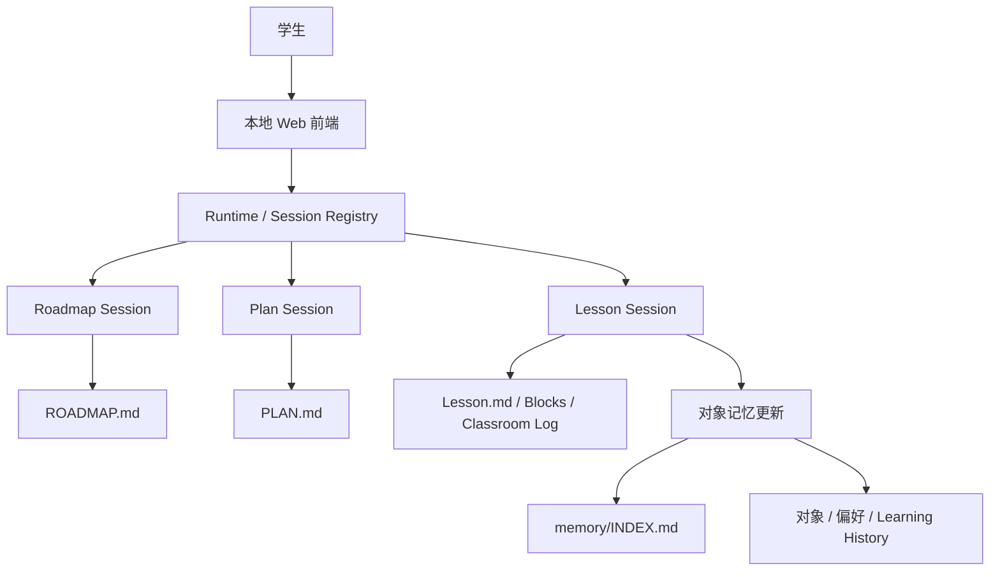
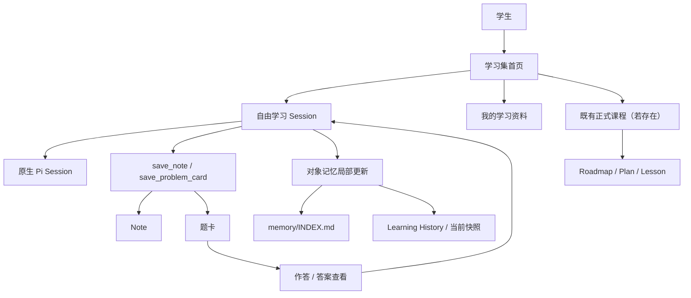

# StudyForge M1b 北极星：当前系统与最小学习集生长

**状态：** M1b 北极星架构，供实施设计与验收审计

**日期：** 2026-08-08

**当前实现基线：** `292df3b`

**目标范围：** 单一 M1b 闭环，不包含 M1c 或 M1d

## 一、北极星结论

M1b 完成后，学生不需要先拥有 Roadmap、Plan、Lesson 或预置资料，就可以开始一段自由
学习；讨论中可以形成 Note、题卡与教师对象记忆，之后还能重新打开资产、作答并继续问老师。

完整闭环只有一条：

```text
空白学习集
→ 自由学习
→ Note / 题卡
→ 对象记忆
→ 再次使用
```

M1b 没有 `M1b.1`–`M1b.4` 四个阶段。词表、关系图、学习足迹、资料蒸馏、Meta Session 和
自由学习—正式课程合流统一属于 M1c。M1d 尚未设计。

## 二、贯穿前后两个快照的原则

### 2.1 学习效果不能由产物代替

一张卡、一份 Note 或一句“懂了”都不能证明学生掌握。认知判断必须来自学生真实的解释、
推导、比较、使用、作答及其所获帮助。

### 2.2 一个事实只有一个持久所有者

| 事实 | 唯一所有者 |
| --- | --- |
| 正式课堂按 Block 发生了什么 | Lesson Classroom Log |
| 自由学习中实际说过或做过什么 | 原生 Pi Session |
| 独立题卡作答与答案查看 | 只追加 activity 记录 |
| 学生以后继续使用的内容 | Note 或题卡 |
| 教师当前怎样理解学生 | 对象记忆、能力假设或明确偏好 |
| 学生确认的课程承诺 | Roadmap、Plan 或 Lesson 文档 |

资产视图、聊天界面和索引可以投影这些事实，但不能制造第二份真相。

### 2.3 模型负责语义，Runtime 负责权威

Tutor 负责讲解、判断认知变化以及生成 Note/题卡内容。Runtime 负责学习集、Session、ID、
路径、时间、revision、来源、权限、原子性、幂等和投影。模型不猜权威字段，Runtime 不判断
学生是否理解。

### 2.4 渐进式披露

每个 Session 只获得自己的根契约、学生明确选择的资产和紧凑 `memory/INDEX.md`。需要历史
判断时先读对象记忆，只有需要核查时才下钻来源 Lesson 或原生 Session。聊天历史、资产正文
和教师记忆不重复常驻。

## 三、快照 A：M1b 之前的系统

### 3.1 产品形态

当前 StudyForge 已经拥有完整的正式课程循环：

```text
Roadmap → Plan → Lesson
```

- Roadmap 讨论长期方向并创建下一个 Plan；
- Plan 在一个阶段中动态讨论和准备下一节 Lesson；
- Lesson 根据 Blocks、Student View、Teacher Control 与 Classroom Log 正式授课；
- Plan Coach 可以调用 Scout 做浅召回、Reviewer 做点名风险核验；
- 已批准的课堂内容可以排版为打印讲义；
- M1a 在正式课末直接把有意义的变化写入对象 Learning History 与当前快照。

当前系统的主要拓扑是：



### 3.2 当前缺口

没有 Roadmap 时，学生无法自然进入系统。他不能只带着一个问题开始聊天，也不能在讨论中
保存一份 Note 或新题卡，再从资产页作答、看答案并重新问老师。

因此当前产品仍然要求“先有课程结构”，而不是允许学习集从真实使用中生长。

## 四、快照 B：M1b 完成后的系统

### 4.1 总拓扑

M1b 不改写正式课程，而是在学习集根增加一条并行入口：



自由学习和正式课程共享 Tutor 教学核心与对象记忆，但不共享冲突的 Session 路由：

- 正式 Lesson 有 Plan 父级、Blocks、Uses、Teacher Control 和 Classroom Log；
- 自由学习没有预设目标、课程父级、Blocks、Log、Trace 或课末结算；
- 自由学习的实际对话只存在于原生 Pi Session；
- 两者都不能让历史判断覆盖学生眼前表现。

### 4.2 Session 层级

| Session | 是否属于课程树 | 直接责任 | M1b 是否修改 |
| --- | --- | --- | --- |
| Roadmap | 是 | 长期方向与下一个 Plan | 否 |
| Plan | 是 | 阶段安排与下一节 Lesson | 否 |
| Lesson | 是 | 多 Block 正式授课 | 否 |
| 自由学习 | 否 | 开放讨论、保存资产、在真实变化出现时更新对象记忆 | 新增 |

自由学习是首页固定入口。学生可以无上下文开始，也可以选择一张或多张题卡、Note 后开始；
允许多个线程并存。它不因为变长、产生资产或出现教学行为而自动升级为 Lesson。

学生显式结束只控制 Session 生命周期。超时、离开页面、沉默或开启另一线程都不能推断为
“已经学完”；结束也不强制生成 Summary 或记忆。

### 4.3 学习资产

M1b 只有 Note 与题卡两种核心资产。

#### Note

Note 可以混合普通 Markdown 正文与带 prompt / answer 的回忆块。“保存为笔记”和“保存为
闪卡”是两种自然交互，底层都写入 Note；M1b 不创建独立 Flashcard 或复习排程。

#### 题卡

题卡是一个 canonical 对象，拥有题干、标准答案、教师讲解依据、学生题内笔记、稳定 ID 与
revision。学生、Tutor 和 Scout 读取不同安全投影，但不会把它拆成教师题卡和个人题卡。

旧完整题卡继续工作；自由学习中新形成的题可以使用薄兼容形状。M1b 不建立新共享词表、
`core` / `related` 标签或语义图。

#### 保存门

自由学习 Tutor 可以自然提议保存，但必须让学生知道要保存什么，并等待明确确认。学生在
资产页主动编辑并保存，本身就是确认。M1b 不让 Plan、正式 Lesson、Meta 或 Roadmap 获得
新的资产生成能力；这些入口的合流留给 M1c。

### 4.4 题卡作答

题卡正文不持有作答历史。独立、只追加的 activity 记录保存题卡 ID、当时 revision、学生
答案或“不会”、Runtime 时间，以及答题前是否已查看标准答案。

```text
打开题卡
→ 作答或选择不会
→ 追加原始事件
→ 查看标准答案
→ 离开，或带着本次作答问老师
```

“问老师”开启一个带题卡、最近作答和答案查看状态的自由学习 Session。查看答案、保存资产
或未进入 Tutor 的作答都不会自动形成掌握判断。

### 4.5 对象记忆

自由学习不建立 Log 或 Trace，而是直接从原生 Pi Session 更新 M1a 对象记忆。记忆可以在
对话中途形成，不等待 Session 结束。

唯一触发门是：

> 如果没有本次对话，未来教师对“学生现在怎样理解这个对象、学到哪里、边界在哪里”的
> 判断是否会不同？

首次独立完成、新误解、提示依赖变化、旧判断被推翻、保持或退化，以及学生得出关键结论、
建立重要联系或发生认知框架转变，都可能触发。关键结论至少要出现在学生的重新表达、推导、
比较或使用中；教师讲解加一句“懂了”不够。

写入形状是：

```text
Tutor：对象目标 + Learning History 变化 + 实际变化的快照字段
Runtime：来源 Session + 时间 + 路径与身份
```

Learning History 只追加；Current Judgment、Evolution Overview 与 Boundaries 只局部更新。
来源绑定整个 Session，不绑定消息轮次。偏好只有学生明确表达时才写。

### 4.6 再次使用

下一次自由学习按以下顺序披露：

```text
自由学习根契约
→ 学生明确选择的资产
→ memory/INDEX.md
→ 相关对象记忆
→ 必要时下钻来源 Session
```

“我的学习资料”只需要支持按类型与最近使用浏览、Note 阅读编辑与回忆块翻面、题卡作答与
答案门，以及带上下文再次问老师。标签导航、语义邻居和聚合学习足迹进入 M1c。

## 五、M1b 前后的变化面

| 架构面 | M1b 之前 | M1b 完成后 |
| --- | --- | --- |
| 学习集启动 | 需要 Roadmap | 无 Roadmap 也能进入自由学习 |
| Session | Roadmap / Plan / Lesson | 增加根级、多线程自由学习 |
| 对话事实 | 正式节点 Pi Session + Lesson Log | 自由学习只使用原生 Pi Session |
| 学习资产 | 主要是预置题卡与课程产物 | 增加学生可保存、编辑和再次使用的 Note / 题卡 |
| Flashcard | 无 | Note 的回忆块体验，不新增对象 |
| 作答 | 主要发生于课堂对话 | 题卡支持独立作答、答案门和再次问老师 |
| 记忆 | 正式 Lesson 课末更新 | 自由学习也能在对话中途直接更新 |
| 课程树 | Roadmap → Plan → Lesson | 原样保留，自由学习不挂树 |
| 词表与图谱 | 现有旧题卡系统 | 原样保留，不在 M1b 扩建 |

## 六、完整实例

林然新建了一个没有 Roadmap 和学习资产的化学学习集。他从“问老师”进入自由学习，直接问：

> Ksp 为什么看起来就只是几个离子浓度相乘？固体去哪了？

Tutor 不要求他先填写目标，也不创建 Roadmap。经过比较一般平衡常数和沉淀溶解平衡，林然
在提示“纯固体活度怎样变化”后，重新解释出 Ksp 是一般平衡常数在特定体系中的表达，而非
一条孤立规定。

这次学习产生三种互不冒充的结果：

1. 原生 Pi Session 保存完整讨论和教师帮助；
2. 学生确认后保存一份含解释正文与回忆块的 Note，并保存一张可独立作答的题卡；
3. Tutor 当场把认知变化写入对象 Learning History，说明该关系在提示后形成，尚未检验能否
   迁移到其他多相平衡。

学生显式结束 Session，不触发额外结算。

几天后，他从“我的学习资料”打开题卡，独立作答后查看标准答案，发现自己仍把“沉淀量变多”
理解成“Ksp 变大”，于是点击“问老师”。新自由学习 Session 获得当前题卡、最近作答、答案
查看状态和相关对象记忆；Tutor 根据眼前表现继续教学，而不是把旧判断当成结论。

到这里 M1b 已完整闭环。它不上传教材、不生成词表、不创建课程，也不把这些能力伪装成
“下一小步”。

## 七、M1c 与 M1d 的交接边界

M1c 承接已经确认、但不属于 M1b 的能力：

- 动态词表、平坦标签和可重建语义关系；
- 面向学生的学习足迹；
- 原始资料按真实需要渐进蒸馏；
- Meta Session 创建 Roadmap；
- 空白学习集与已有证据的学习集合流；
- 自由学习与 Roadmap / Plan / Lesson 正式周期合流。

M1d 必须等 M1b 与 M1c 的行为验收完成后再讨论。当前文档不得把导入、发布、分享、社区、
权限市场或其他未裁决功能预先写成 M1d 承诺。

## 八、M1b 验收问题

### 8.1 教学真实性

- 学生能否只用普通语言完成整个闭环？
- Tutor 是否避免把保存资产、查看答案、教师讲解或“懂了”误当掌握？
- 真正的关键结论和认知转变能否被写入，而普通闲聊不会被过度记录？

### 8.2 所有权

- 自由学习事实是否只存在于原生 Pi Session？
- Note、题卡、作答和对象记忆是否各有唯一所有者？
- 对象记忆是否只引用来源 Session，而不复制对话或要求消息级证据？

### 8.3 Agent 与上下文

- 自由学习是否只加载自己的根 Skill，而不承担 Block、Plan 或课末收口指令？
- 无上下文和选中资产两种入口是否都能保持小而正确的上下文？
- 二次自由学习能否按需获得资产、最近作答与对象记忆？

### 8.4 Runtime 与恢复

- 多线程、显式结束、重启恢复和 stale revision 是否可靠？
- 学生确认前是否绝不保存资产？
- 对象记忆能否在 Session 中途原子更新，而结束不触发隐式写入？
- 是否存在为了实现方便而把自由学习挂进课程树、创建 Log 或复活 Trace 的诱惑？

### 8.5 版本边界

- 实现是否只完成 M1b 闭环？
- 是否偷偷加入词表图谱、学习足迹、资料蒸馏、Meta 或正式课程合流？
- 后续设想是否明确写成 M1c 或未裁决，而不是重新发明 M1b 子阶段？

## 九、北极星判断

M1b 的成功不在于生成了多少资产，而在于学生可以从一句普通问题开始，经过真实讨论留下
可继续使用的内容和有边界的教师记忆，并在下一次学习中自然接续；同时，正式课程与未来
M1c 能力都没有被提前揉进来。
