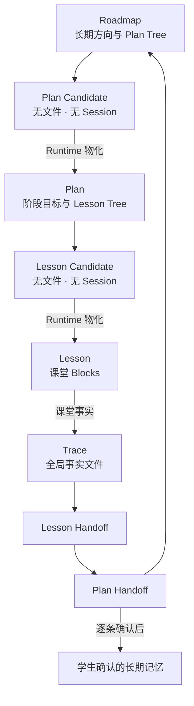
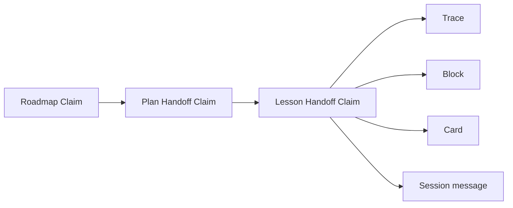
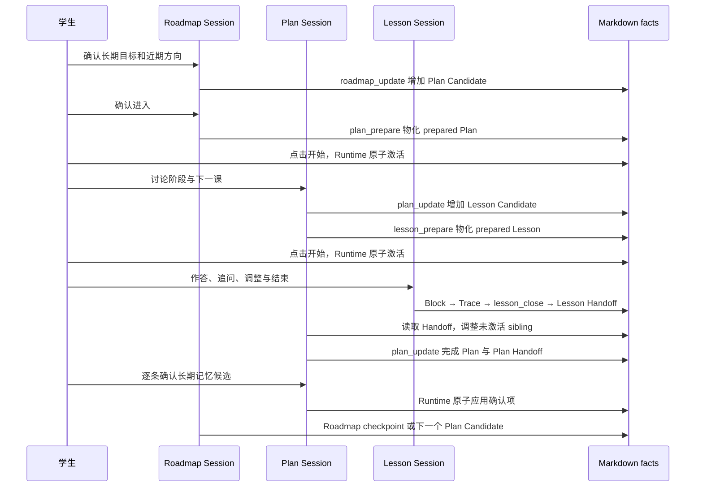

# 学习节点树与证据继承

本文是 StudyForge 当前 Markdown 协议的开发者说明。它回答四个问题：

1. Roadmap、Plan、Lesson 如何组成真正的控制树；
2. 每个节点何时有文件、何时有 Session、谁可以修改它；
3. 前课信息如何压缩给父节点，再传给后续节点；
4. 如何从一句阶段判断一直回到原始课堂、题卡和对话。

## 一、核心模型



这里的树不是前端画出来的目录装饰，而是写入权限本身：

- Roadmap 只能编排尚未物化的 Plan Candidate；
- Plan 只能编排尚未物化的 Lesson Candidate；
- Lesson 只管理自己的 Block 和课堂事实；
- 子节点一旦激活，父节点不再改写它；
- 新判断通过新节点、Trace 更正或新 Handoff 表达，不回头篡改历史。

## 二、目录与事实归属

```text
learning-set/
├── ROADMAP.md
├── LEARNING_GUIDE.md
├── plans/
│   └── plan-001.md
├── lessons/
│   └── lesson-001.md
├── traces/
│   └── trace-<uuid>.md
├── memory/
│   ├── student-profile.md
│   ├── teaching-profile.md
│   └── planner-attention.md
├── cards/
├── graph/
└── materials/
```

| 事实 | 唯一 owner | 说明 |
|---|---|---|
| 长期目标、Plan 编排 | `ROADMAP.md` | `Plan Tree` 同时保存候选和已物化子节点 |
| 阶段目标、Lesson 编排 | `plans/<id>.md` | `Lesson Tree` 同时保存候选和已物化子节点 |
| 课堂结构和停止点 | `lessons/<id>.md` | Block、alias、Summary、Handoff |
| 一次课堂判断 | `traces/<id>.md` | 全局池；反向冻结 Plan/Lesson/Block/题卡 |
| 跨节点压缩 | 子节点 `Handoff` | Claim 必须带原始来源 |
| 稳定偏好 | 两份 profile | 只能由完成的 Plan Handoff 提议、学生确认 |
| 原始对话 | Pi Session JSONL | 不复制进 Markdown，不是长期记忆 |

`planner-attention.md`、能力图、首页续学位置和前端面板都可以删除重建，不是
事实 owner。

## 三、三种节点的最小格式

### Roadmap

```markdown
---
id: roadmap
kind: roadmap
status: active
roadmap_coach_session: null
---
# 导数综合能力

## Goal

把定义域和参数边界真正用于导数综合题。

## Observable Capability Standard

在两道不同结构的未见题中，无提示写全合法域并用于边界判断。

## Test

完成一题陌生嵌套约束的首次尝试。

## Plan Tree

### Candidate plan-candidate-001

- Public purpose: 加固定义域完整性。
- After:
- Depends on:
- Consider when: 学生仍会在变形前遗漏合法域。
- Sources:
  - memory:student/S1
- Private note: 先做窄诊断，不预设完整路线。
```

Candidate 的 handle 只在当前父树内唯一。它没有 `plans/*.md` 文件，也没有
Session，因此前端只能展示建议，不能进入聊天。

### Plan

```markdown
---
id: plan-001
kind: plan
status: prepared
parent_id: roadmap
parent_path: ROADMAP.md
coach_session: null
---
# Plan：定义域完整性

## Goal

让定义域从附加检查变成推导前提。

## Observable Capability Standard

连续两题无提示写全并使用合法域。

## Test

完成一题未见结构的边界判断。

## Planning Basis

已有一次遗漏和一次修正，尚未证明连续独立。

## Activation Snapshot

- Parent: roadmap:roadmap
- Activated at: pending

### Selected Context

- trace:trace-fixture-001
- memory:student/S1

### Content Boundary

- 不在激活前公开目标题或决定性方法。

### Adaptation Brief

- Working judgment: 当前关键是连续独立，而不是再听一遍定义。
- Sources:
  - trace:trace-fixture-001
- Design consequence: 使用不同结构做两次首次尝试。
- Revise if: 第一课已显示更基础的概念混淆。

## Lesson Tree

### Candidate lesson-candidate-001

- Public purpose: 找到定义域遗漏发生在哪一步。
- After:
- Depends on:
- Consider when: 学生确认开始本阶段。
- Sources:
  - trace:trace-fixture-001
- Private note: 物化时再选择真实题卡。

## Current Position

等待学生激活。

## Plan Summary

尚无本周期课堂结果。

## Handoff

（尚未封存）
```

Runtime 物化 Plan 时分配 `plan-001` 和路径；Agent 不能指定它们。学生点击开始后，
Runtime 才把 `Activated at` 从 `pending` 封存为时间戳并创建 Coach Session。

### Lesson

```markdown
---
id: lesson-001
kind: lesson
status: prepared
parent_id: plan-001
parent_path: plans/plan-001.md
tutor_session: null
---
# Lesson：第一次独立核验

## Activation Snapshot

- Parent: plan:plan-001
- Activated at: pending

### Selected Context

- claim:lesson-000/handoff#learner-c1
- card:cards/derivative/example.card.yaml

### Content Boundary

- 首次尝试前不公开候选方法。

### Adaptation Brief

- Working judgment: 学生会列条件，但未必在推导中使用。
- Sources:
  - claim:lesson-000/handoff#learner-c1
- Design consequence: Block 只检查条件是否真正改变边界。
- Revise if: 学生在读题时已经无法识别基本对象。

## Capability Target

独立写出合法域，并指出它在哪一步改变结论。

## Block block-001（必做）

### Node State

- Kind: problem
- Required: true
- Status: pending
- Depends on:
- Uses: Q-001

### Student View

请先独立完成这道题，并说明条件在哪里被使用。

### Teacher Control

首次尝试不提示；只评价学生已经写出的内容。

## Lesson Summary

（课堂结束后填写）

## Aliases

- Q-001: ../cards/derivative/example.card.yaml

## Handoff

（尚未封存）
```

Block ID、依赖和 alias 在物化时由 Runtime 编译。学生启动后才创建 Tutor Session。
Lesson 可以动态插入、重排或跳过尚未完成的 Block，但同时只能有一个 active Block。

## 四、全局 Trace

```markdown
---
id: trace-2d8c...
kind: classroom-trace
plan_id: plan-001
plan_path: plans/plan-001.md
lesson_id: lesson-001
lesson_path: lessons/lesson-001.md
block_id: block-001
card_path: cards/derivative/example.card.yaml
card_step_id: step_2
material_path: null
occurred_at: 2026-07-31T10:20:00.000Z
assessment: partially_correct
support: none
supersedes: null
---
# Classroom Trace

## Method Binding

- Primary: null
- Secondary: []

## Observation

学生独立写出定义域，但没有用它排除端点取等。
```

Trace 是全局池中的事实文件，不嵌在 Lesson 里。它既可以按题卡反查，也可以按
Plan、Lesson、Block、时间和文本查询。一次更正生成新 Trace：

```text
trace-new.supersedes = trace-old.id
```

旧文件继续存在；普通搜索和能力投影只使用 active revision。依赖旧 Trace 的
Handoff Claim 不被批量改写，而是在读取时显示为 `invalidated`。

## 五、Handoff 契约

Handoff 是有来源的压缩，不是自由摘要。完整 Claim 包含：

- `Statement`：当前可以成立的判断；
- `Scope`：判断只覆盖什么范围；
- `Sources`：至少一个可解析来源；
- `Boundary`：尚未证明或已知冲突；
- `Next use`：父节点如何使用它。

```markdown
## Handoff

- ID: lesson-001/handoff
- From: lesson:lesson-001
- To: plan:plan-001
- Sealed at: 2026-07-31T10:30:00.000Z

### Learner C1

- Statement: "学生能独立列出合法域。"
- Scope: "本课一题未见结构。"
- Sources:
  - trace:trace-2d8c...
- Boundary: "还没有独立处理端点取等。"
- Next use: "下一课保持无提示，只改变题型外壳。"

### Source Index

- trace:trace-2d8c...
```

如果学生选择结束，而模型没有给出合法 Claim，Lesson 仍然可以关闭。Runtime 会
写入 source-only Handoff，列出本课 active Trace 与 Session 来源。关课主动权不会
被 Reflection 或 Claim 格式卡住。

证据回溯是递归的：



## 六、Context Frame

每个节点 Session 只装配四类页面：

| 页面 | 内容 | 生命周期 |
|---|---|---|
| Resident | 教学内核、节点角色、学习集原则、选中的已确认偏好、工具与权限 | 每轮常驻 |
| Frozen | 父节点交付的 Activation Snapshot | 节点激活后不变 |
| Local | 当前节点 Markdown、当前 Session | 随本节点推进 |
| Index | 子 Handoff/Claim、范围内 Trace 查询、题卡/材料查询入口 | 按需下钻 |

Plan 或 Lesson 不复制父 Session，也不自动读取所有兄弟课堂。父节点先用 Handoff
压缩历史；只有当前判断确实需要时，才沿 Claim 来源回到 Trace、Block、题卡或
Session。这保留了连续性，也避免把整个学期对话塞进每一节课。

## 七、工具与文件权限

| 节点 | 可写事实 | 可调用的关键工具 | 不允许 |
|---|---|---|---|
| Roadmap | 里程碑、Plan Candidate、Roadmap checkpoint | `roadmap_update`、`plan_prepare` | 改写已物化 Plan/Lesson |
| Plan | 当前 Plan 决定、Lesson Candidate、Plan Handoff、记忆候选 | `lesson_prepare`、`plan_update`、`memory_review_propose` | 改 Roadmap、改 active/terminal Lesson、直接写画像 |
| Lesson | Block 状态、Trace、Lesson Summary/Handoff、另解 | `classroom_update`、`trace_append`、`lesson_close` | 改父 Plan/Roadmap、直接写画像 |

三类节点都可使用范围受限的题卡、Trace 搜索和来源解析。Node Session 不暴露面向
整个 learning set 的原生写文件工具。Plan/Lesson 启动和长期记忆应用由 Runtime
执行，不是模型工具。

## 八、完整写入通路



## 九、恢复和重备课

- 刷新只从公开树状态与 owner 匹配的 Session 恢复，不读取 Teacher Control；
- Candidate 没有 Session，prepared 节点也不会在未点击时偷偷启动；
- prepared 子节点可以用同一 handle 重新准备；
- active、paused 或 terminal 子节点不就地重备，父节点新建替代 sibling；
- closed/abandoned Lesson 只读回放；
- completed/abandoned Plan 只读回放，重新进入学习必须由新的明确决策产生。

## 十、长期记忆

长期记忆不是每课自动总结。只有 completed Plan 的 Handoff Claim 可以成为候选
来源：

```text
completed Plan Handoff
→ memory_review_propose
→ 学生逐条采用 / 改写后采用 / 不采用
→ Runtime 校验来源和当前 profile
→ 双文件原子写入
→ 同一 Plan Session 保存 receipt
```

删除或修改已有偏好必须精确匹配其 ID 与 Content。未经学生确认，Lesson Summary、
Plan Summary、能力分数或模型推断都不能直接进入长期画像。

## 十一、不兼容说明

当前 Runtime 只接受树节点协议，不自动迁移线性学习集。旧文件应先保留副本和来源，
再转换为：

- Roadmap 的 `Plan Tree`；
- Plan 的 `Lesson Tree`；
- Lesson/Plan 的 `Activation Snapshot` 与 `Handoff`；
- `traces/*.md` 全局 Trace 文件；
- `parent_id` / `parent_path` 所表达的真实父子关系。

仓库不保留双读、猜测或静默修补路径。解析失败应修正源文件，而不是增加兼容层。
